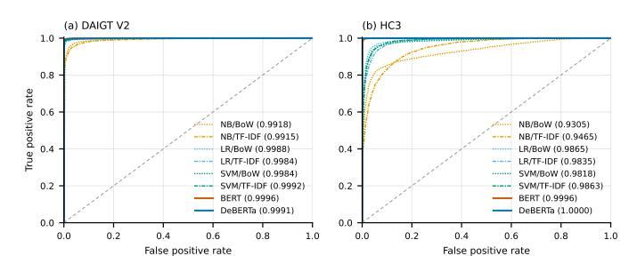
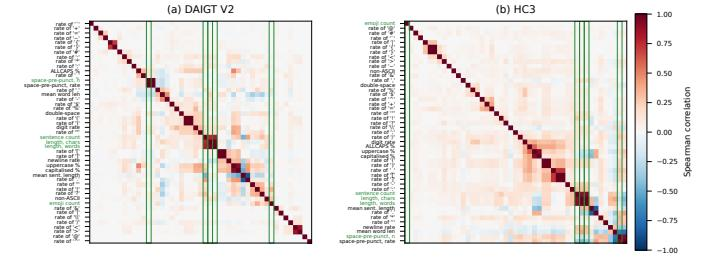

# A Surface-Content Decomposition of AI-Generated Text Detection Benchmarks

Anonymous Author(s) Affiliation withheld for double-blind review

*Abstract*—A detector scoring 99% on a machine-generatedtext benchmark may have learned how machine language differs from human language. It may instead have learned how one corpus was punctuated. The headline number does not separate the two. We decompose the signal into three arms. A surface-only model reads 47 orthographic features and never sees a word. A content-only model reads text stripped of punctuation, casing and non-ASCII characters. A fine-tuned transformer on raw text is the reference. On HC3 the two arms are indistinguishable under a paired test, 3.20% against 3.26% error, and the null holds on five of five partitions with the sign changing between them. DeBERTa reaches 0.28% on the same split, so the parity joins two weak arms rather than a ceiling. On DAIGT V2 content is stronger by a factor of 7.9 in error. Subgroup splits localise that result rather than confirm it. The surface arm reaches 0.01% error on the Reddit sub-corpus, which is 74.8% of HC3, and loses to content on both other domains large enough to test. Removing the cue responsible, the rate of spaces before punctuation, costs that arm 10.03 points. BERT emits identical token identifiers for strings differing only by that cue, so it cannot represent it, and it still reaches 0.9916 weighted F1. Surface form is informative on both corpora. We claim only that it reaches parity with content on one, and there for one reason.

*Index Terms*—AI-generated text detection, benchmark evaluation, surface features, shortcut learning, tokenisation

## I. INTRODUCTION

Detectors of machine-generated text report accuracy at or above 97% on the benchmarks the field uses most, and often above 99% [\[1\]](#page-5-0), [\[2\]](#page-5-1), [\[3\]](#page-5-2). Read directly those numbers say the task is close to solved, and read carefully they say something weaker. A benchmark score measures the separability of a particular corpus rather than the capability a reader infers from it.

Separability has more than one source. A detector can reach a high score by modelling how machine-generated language differs from human language, or by modelling how one corpus was assembled, punctuated and encoded. Instances of the second kind are documented, and they include a whitespace convention in HC3 [\[4\]](#page-5-3), a length confound in the same corpus [\[5\]](#page-5-4) and prompt-specific collection shortcuts [\[6\]](#page-5-5). What is missing is a way to ask how much of a benchmark's separability owes to surface form rather than content, and to place two benchmarks on that one axis.

Three lines of prior work come close and each stops short. Shared benchmarks such as RAID [\[7\]](#page-5-6) and M4 [\[8\]](#page-5-7) make detectors comparable across conditions but do not ask what any one condition is separable by. Cleaning kits remove a single known cue [\[4\]](#page-5-3), yet a null after cleaning says nothing unless the detector could read that cue. Partial-input baselines expose artefacts in natural language inference [\[9\]](#page-5-8), [\[10\]](#page-5-9) but have not been moved to detection, where the artefact is a property of the text rather than a span of it.

This paper proposes that measurement and compares three arms on identical splits. A *surface-only* model reads 47 orthographic features and never sees a word, a *content-only* model reads text after punctuation, casing and non-ASCII characters are stripped, and a *full* model is a fine-tuned transformer on raw text. The first two share a classifier family and are directly comparable, while the third is a reference point rather than a matched arm. The object of measurement is a corpus rather than a detector, and we offer no detector comparison, since a fair one would need matched training data on both corpora. On HC3 the two arms are indistinguishable at 3.20% against 3.26% test error, while on DAIGT V2 content is stronger by a factor of 7.9. Splitting each corpus by its own subgroup labels then shows the HC3 tie belongs to the Reddit sub-corpus that is three quarters of it. The main contributions are the following.

- A surface-content decomposition, stated formally in Section [III-D](#page-1-0) as a reusable measurement over any humanversus-machine corpus, with the length control that stops its two arms sharing a channel.
- Its application to two benchmarks and their eighteen subcorpora (Sections [IV-B](#page-3-0) and [IV-C\)](#page-3-1), locating the HC3 result in one collection convention in one dominant domain, where removing that convention costs the surface arm ten points.
- A tokenisation control (Section [IV-D\)](#page-4-0) establishing that the most-discussed cue in HC3 is sufficient in isolation yet unnecessary in practice, since BERT cannot represent it and still reaches 0.9916 weighted F1 there.

# II. RELATED WORK

Guo et al. [\[1\]](#page-5-0) asked whether ChatGPT answers can be told apart from human answers across several domains at once. They proposed HC3, a paired corpus of 85,449 questionanswer rows from five English sources, with RoBERTa detectors fitted on it. The document-level detector reached 99.82 F1, which later work narrows to roughly 91.7% under semanticinvariant tasks [\[2\]](#page-5-1). One generator was collected in one window, and the paper does not ask which property of the text that score rests on.

Tian et al. [\[4\]](#page-5-3) addressed detection when documents are too short for document-level evidence. They proposed a multiscale detector trained across text lengths and released a cleaning kit for the HC3 whitespace convention. Their appendix builds a detector out of a single test for one token identifier, which reaches 82.12 F1 at sentence level against the 81.89 they quote for a fine-tuned RoBERTa. The experiment removes one cue already known, so it bounds neither the total separability carried by surface form nor how that total compares across corpora.

Zhou et al. [3] asked whether a transformer is necessary on the competition-era essay benchmarks. Their approach fits classical classifiers over character n-gram features instead of fine-tuning a pretrained model. On DAIGT V2 that featurisation reaches accuracy competitive with transformer detectors, which is consistent with the tie in Section IV. The finding is stated as a score rather than a decomposition, so what the n-grams read is left open. Work pairing DeBERTa with stylometric features [11] or detecting from style embeddings [12] likewise combines the two channels where we hold them apart.

RAID [7], M4 [8] and SemEval-2024 Task 8 [13] make detector results comparable when generators, domains and attacks vary at once. Each releases labelled conditions and a leaderboard, so a detector is scored per condition rather than in aggregate. What they do not ask is what any one condition is separable by, which is the axis added here. The same blind spot is documented elsewhere, since vision datasets are identifiable from their own images [14] and an inference model reading only the hypothesis scores far above chance [9], [10], [15]. Our surface arm is that partial-input baseline moved to detection, read under the caveat of Feng et al. [16], since a high partial-input score shows a dataset is cheatable while a low one does not show it is clean.

Antoun et al. [17] studied how far reported accuracy survives contact with a hostile writer. They perturbed inputs with misspellings and homoglyphs and re-scored HC3-trained detectors without retraining them. Under that attack a detector falls from 99.88 F1 to 33.57% accuracy, and deployed detectors flag non-native English writing as machine-generated at high rates [18]. Both report the fragility without locating what the detector relied on, which is what a decomposition supplies.

None of this work measures how much of a benchmark's separability is carried by surface form. Where [4] removes one cue and [7], [8] compare detectors across conditions, this paper measures each corpus with two matched arms, locates the result per sub-corpus, and checks whether the detector can read the cue at all.

#### III. METHOD

#### A. Problem setting

The object of measurement is a corpus, and given a human-versus-machine benchmark we ask how much of its separability a model could obtain without reading the language. The instruments are two matched classifiers over disjoint views of each document, plus a fine-tuned transformer as a reference (Fig. 1). We assume balanced classes, English text and a 128-token transformer budget, and make no claim about which detector is best.

#### B. Corpora and partitioning

DAIGT V2 [19] contains 44,868 argumentative student essays, 27,371 human-written and 17,497 machine-generated by a mixture of 2023-era systems. HC3 [1] contains 85,449 question-answer rows from five English sources, contrasting human answers with GPT-3.5-Turbo. The two differ in nearly every respect that matters here, since DAIGT V2 has many generators, one genre and long documents where HC3 has one generator, five domains and short ones. Both were class-balanced by downsampling to 34,994 and 53,806 rows, which fixes a degenerate single-class predictor at 0.333 weighted F1.

HC3 carries 6,118 duplicate rows, 7.16% of the corpus, so the split is group-aware. Documents are grouped by an MD5 hash of their whitespace-normalised lowercased text, and whole groups go to one partition of a 72/8/20 division. Measured directly, that rule leaks 0 of 10,732 HC3 test documents where a plain stratified split of the same sample leaks 570, or 5.30%. The split is built once and reused by every model and seed.

#### C. Models

Five families are evaluated. Three are classical, namely Naive Bayes, logistic regression and a linear support vector machine, each under bag-of-words and TF-IDF. Two are transformers, bert-base-uncased [20] and microsoft/deberta-v3-base [21], fine-tuned over a sixteen-run grid per dataset varying learning rate, batch size and weight decay, with the operating point selected on validation weighted F1. DeBERTa's SentencePiece tokeniser [22] encodes leading whitespace and BERT's WordPiece does not, which makes the pair a controlled contrast on the cue Section IV-D examines.

#### D. The decomposition

Write x for a document and  $y \in \{0,1\}$  for its label, with 1 denoting machine-generated. The surface map  $\phi_S$  sends a document to  $\mathbb{R}^{47}$ , a vector of orthographic statistics covering punctuation, whitespace behaviour including spaces before punctuation, casing, length, non-ASCII and digit rates, and it reads no word identity. The content map  $\phi_C$  lowercases, replaces every character outside the lowercase Latin alphabet and whitespace with a space, collapses whitespace runs, then takes raw bag-of-words counts. Punctuation, casing and non-ASCII cannot enter it.

Each arm fits one logistic regression on the same training partition,

$$h_a = \arg\min_{h} \sum_{(x,y)\in\mathcal{D}_{tr}} \ell(h(\phi_a(x)), y) + \frac{1}{2C} ||h||_2^2, \quad (1)$$

for  $a \in \{S,C\}$ , with C at the library default for both. Sharing the classifier family and the regularisation is what makes the two arms comparable. We report the held-out error  $\varepsilon_a$  of each arm and the gap  $\Delta = \varepsilon_S - \varepsilon_C$ , where a gap near zero says orthography alone reaches the accuracy of content alone. The comparison is between two specific arms rather than a partition

Fig. 1. The measurement pipeline and its three arms

of the total separability, so a richer featurisation would lower either side.

One channel reaches both arms, since the surface arm reads size counts directly and raw bag-of-words rows sum to document length. Length is a documented confound on both corpora [5], so we drop the five size-scaling surface features and normalise content rows to unit total before rescaling by the mean training document length. That rescaling matters, because rows summing to one shrink every feature and the arm would otherwise collapse for reasons of scale rather than length.

#### E. Statistics and controls

Transformer baselines are read from the deployed checkpoint's own record rather than from a grid maximum, and comparisons on the same test set are paired. Writing b and c for the discordant counts, we report the exact two-sided binomial p-value [23] with a paired bootstrap 95% interval on the error difference over 10,000 resamples [24], resampling document indices so the pairing is preserved. A bootstrap says nothing about how the corpus was partitioned and the central claim here is a null, so the decomposition is repeated over five group-aware partitions varying only the split seed. We run no parametric tests at  $n \leq 30$ .

Two controls guard the claims below. A *tokenisation* control compares token identifier sequences for minimally different strings, since whether a detector can exploit a character-level cue is a property of its tokeniser. A *pipeline-fires* control confirms that a cleaning step reporting no change actually executed, by applying the same pipeline where the step removes something the tokeniser can represent.

#### F. Reproducibility

Partitions are built once at split seed 42 and reused by every model and training seed, so only initialisation and batch order vary between runs. The four deployed checkpoints were retrained at seeds 123 and 456, with the ranges in Table II. Fine-tuning ran three epochs at a 128-token budget on one 8 GiB consumer GPU, the longest run taking 1,111 seconds at 4.22 GiB peak memory, under PyTorch 2.11, Transformers 4.57 and scikit-learn 1.9. Code, split manifests and the per-run record behind every number are kept in a public repository, withheld here for anonymity.

TABLE I
TEST ERROR FOR ALL EIGHT CONFIGURATIONS. BOLD MARKS THE BEST PER CORPUS.

| Model         | Rep.   | DAIGT V2 err % | HC3 err % |
|---------------|--------|----------------|-----------|
| Naive Bayes   | BoW    | 4.09           | 12.87     |
| Naive Bayes   | TF-IDF | 4.23           | 13.28     |
| Logistic Reg. | BoW    | 1.07           | 4.49      |
| Logistic Reg. | TF-IDF | 1.43           | 6.35      |
| SVM           | BoW    | 1.30           | 5.25      |
| SVM           | TF-IDF | 0.90           | 5.51      |
| BERT          | raw    | 0.84           | 0.84      |
| DeBERTa       | raw    | 0.83           | 0.28      |

TABLE II
SEED STABILITY OF THE FOUR DEPLOYED CHECKPOINTS.

| Corpus   | Model   | s42    | s123   | s456   | mean   | range  |
|----------|---------|--------|--------|--------|--------|--------|
| DAIGT V2 | BERT    | 0.9916 | 0.9927 | 0.9920 | 0.9921 | 0.0011 |
| DAIGT V2 | DeBERTa | 0.9917 | 0.9941 | 0.9931 | 0.9930 | 0.0024 |
| HC3      | BERT    | 0.9916 | 0.9952 | 0.9923 | 0.9930 | 0.0036 |
| HC3      | DeBERTa | 0.9972 | 0.9972 | 0.9967 | 0.9970 | 0.0005 |

Fig. 2. ROC curves for every configuration, with AUC in the legend.

#### IV. RESULTS

# A. A classical model matches a transformer on DAIGT V2 until the text budget is matched

Table I reports every configuration, and the two benchmarks part company. On DAIGT V2 the best classical configuration sits 0.07 error points above the best transformer. The two disagree on 99 documents split 47 to 52, so McNemar returns p=0.69 and the paired interval, [-0.21,+0.34] points, contains zero. On HC3 the same comparison gives 484 discordant cases split 16 to 468 at  $p<10^{-6}$ , with an error difference of +4.21 points. Fig. 2 shows that ranking as threshold-free curves. Reseeding the four checkpoints at 123 and 456 moves them very little, as Table II reports, and the DAIGT V2 pair overlap where the HC3 pair do not.

TABLE III
THE MATCHED TEXT BUDGET. ERRORS ARE PERCENTAGES.

| Corpus   | Window  | kept  | full | window | transf. | difference          |
|----------|---------|-------|------|--------|---------|---------------------|
| DAIGT V2 | BERT    | 33.5% | 0.90 | 2.10   | 0.84    | +1.26 (0.90-1.63)   |
| DAIGT V2 | DeBERTa | 34.1% | 0.90 | 2.09   | 0.83    | +1.26 (0.90-1.61)   |
| HC3      | BERT    | 74.6% | 4.49 | 5.66   | 0.84    | +4.82(4.37-5.26)    |
| HC3      | DeBERTa | 75.6% | 4.49 | 5.72   | 0.28    | +5.44 (5.01 - 5.89) |

TABLE IV
DECOMPOSITION PER CORPUS, THEN HC3 BY DOMAIN. BOLD MARKS
THE LOWER ERROR.

| Arm                        | DAIGT V2 err % | HC3 err % |
|----------------------------|----------------|-----------|
| surface-only               | 7.86           | 3.20      |
| content-only               | 0.99           | 3.26      |
| full transformer           | 0.83           | 0.28      |
| length-only (3 feats)      | 24.59          | 15.23     |
| surface-only, no length    | 9.93           | 3.37      |
| content-only, length-norm. | 0.94           | 6.28      |

|                                                            |                                   | surface                              | content                               | cue present in                          |                                      |
|------------------------------------------------------------|-----------------------------------|--------------------------------------|---------------------------------------|-----------------------------------------|--------------------------------------|
| HC3 domain                                                 | n                                 | err %                                | err %                                 | human                                   | machine                              |
| reddit_eli5 finance medicine open_qa wiki csai | 6,690 684 250 198 168 | 0.01 7.60 4.00 4.04 5.36 | 2.66 3.07 0.40 5.05 11.90 | 98.9% 5.6% 17.0% 60.7% 1.6% | 0.3% 0.1% 0.1% 0.4% 0.2% |

open\_qa and wiki\_csai fall below 200 test rows.

Fig. 3. Surface features ranked by correlation with the label.

That tie is also not a matched comparison, since the classical models read whole documents while the transformers read 128 tokens. We therefore refit the classical grid on the exact character span each tokeniser kept, taken from offset mapping. Held to one text budget the transformers lead on both corpora and every interval in Table III excludes zero, so the unmatched tie was a fact about information access rather than architecture.

#### B. On HC3, orthography alone matches content alone

Table IV gives the decomposition. On HC3 the two arms are indistinguishable at 3.20% error from orthography against 3.26% from content. They disagree on 625 documents split 316 to 309, so McNemar returns p=0.81 and the difference is -0.07 points with interval [-0.52, +0.40]. Forty-seven features that never read a word do as well as a bag-of-words model over the whole vocabulary. On DAIGT V2 the same arms separate by a factor of 7.9, 7.86% against 0.99%, with 569 discordant documents split 44 to 525 at  $p < 10^{-6}$ . Fig. 3 ranks the surface features by their correlation with the label on each corpus.

The content arm is deliberately unfiltered. Refitting it with the stopword removal and lemmatisation of the classical pipeline makes the HC3 filtered arm lose to orthography by 1.30 points where the unfiltered arm ties it. We report the unfiltered arm because it is the stronger opponent, which makes the parity claim harder.

Surface form is informative on both benchmarks, since DAIGT V2's surface arm reaches 0.9214 weighted F1. The finding is not that one corpus is clean but that only on HC3 does surface rise to parity with content. Closing the length channel widens DAIGT V2's content advantage from 7.9 to 10.6 times and turns HC3's parity into a 2.91-point advantage for orthography. A null on one partition is what a lucky split manufactures, so the decomposition runs again over five group-aware partitions. Content leads on DAIGT V2 on all five at  $p < 10^{-6}$ , while on HC3 the difference reaches significance on none, with p of 0.81, 0.27, 0.34, 0.23 and 0.78, and it changes sign between them. That is the strong form of the null, since an underpowered real difference keeps its sign. Tuning the inverse regularisation strength per arm on validation changes no conclusion, since the HC3 arms move to 3.15% and 3.47% error and stay indistinguishable on all five partitions with every interval containing zero.

#### C. The parity belongs to one sub-domain and one cue

Both corpora carry subgroup labels, so the lower half of Table IV runs the same measurement per HC3 domain. On reddit\_eli5 the surface arm reaches 0.01% error, roughly one mistake in 6,690 documents. On the two other domains with enough test rows the ordering reverses, and content wins by 4.53 points on finance with interval [+2.34, +6.87] and by 3.60 on medicine with interval [+1.60, +6.00]. Since reddit\_eli5 is 74.8% of the balanced corpus, the corpuslevel parity is substantially that one domain.

The mechanism is measured rather than inferred. The space-before-punctuation cue appears in 98.9% of reddit\_eli5 human documents against 0.3% of machine ones, and decays to 1.6% on wiki\_csai. A boolean rule treating a document as human when the cue is present scores 94.23% accuracy on the balanced corpus, 94.22 weighted F1, where the sentence-level equivalent in [4] reaches 82.12 F1. Applying that work's cleaning kit changes 44.5% of HC3 documents and moves the surface arm from 3.20% to 13.22% error, a loss of 10.03 points with interval [-10.69, -9.38], while the content arm is untouched at 3.26%.

The same treatment on DAIGT V2 pairs each generator against the shared human pool. Content wins on every generator, while the surface arm's error spans sixteenfold across the ten generators with enough test rows, from 0.50% to 8.13%. Two pairs of the same underlying model contributed by different people differ by factors of 4.1 and 2.3, which we report as suggestive, since the smaller member of each pair holds 184 and 130 test rows. On this evidence surface separability tracks collection provenance more closely than model identity.

Fig. 4. Every headline result in one view.

# D. A model that cannot represent the cue reaches 0.9916 anyway

The natural inference from the cue's dominance is that HC3-trained detectors exploit it, but the test does not support it. BERT's WordPiece tokeniser splits on punctuation irrespective of adjacent whitespace, and it emits identical identifier sequences for "the answer is simple." and "the answer is simple." in three of three pairs tested, where DeBERTa's SentencePiece distinguishes all three. BERT cannot represent the cue and still reaches 0.9916 weighted F1 on HC3. The cue is therefore sufficient in isolation, since the surface arm reading it reaches 0.9680, and unnecessary in practice.

This is also why removing the cue changes nothing for BERT. Whitespace cleaning on HC3 yields predictions bit-identical to the uncleaned run, which alone would be indistinguishable from a step that never executed. The same pipeline on DAIGT V2, where it also removes emoji that WordPiece represents, does change BERT's predictions, so the pipeline fires and the null is specific to whitespace. We do not attribute the BERT-to-DeBERTa difference to this cue, since the two models differ in tokeniser, architecture, pretraining corpus and parameter count. What the experiment establishes is that a null from removing a cue is uninterpretable without first checking the model could read it. Fig. 4 collects the results above.

#### E. Neither corpus transfers to the other

Each deployed checkpoint was also evaluated on the corpus it was not trained on, without adaptation, over three seeds. Every cell loses between 0.0833 and 0.2019 mean weighted F1. Trained on DAIGT V2, BERT falls from 0.9921 to 0.7902 and DeBERTa from 0.9930 to 0.9096, while trained on HC3, BERT falls from 0.9930 to 0.8311 and DeBERTa from 0.9970 to 0.8512. DeBERTa's mean gap is roughly half BERT's in both directions, which we report as a pattern rather than a confirmed effect, since three runs do not support a test. Much of what each model learned is specific to the corpus it was fitted to, which is what the decomposition anticipates.

#### F. A published detector out of domain

Every model above is one we trained, so the RoBERTa detector released with HC3 [25] gives an external reference point, run over the same partitions without fine-tuning. On HC3 it reaches 0.9952 weighted F1, which is contaminated, since our test rows were almost certainly in its training data. On DAIGT V2, which it has never seen, it reaches 0.8230 weighted F1 at 17.55% error against 0.83% for our in-domain DeBERTa. One model was trained on the corpus being scored and the other was not, so the gap is not an architecture result. It bounds how far the 99.82 F1 quoted in Section II travels off its own corpus untuned.

### V. DISCUSSION

The decomposition separates two benchmarks that a headline accuracy figure does not, and applied per sub-corpus it separates one benchmark from itself, since on HC3 orthography alone matches content alone on all five partitions while on DAIGT V2 content is stronger by a factor of 7.9. Section IV-C narrows the first of those to one collection convention in the Reddit sub-corpus that is three quarters of the corpus, and removing that convention costs the surface arm ten points. A single collection convention can be cleaned, whereas the diffuse stylistic signal DAIGT V2's surface arm reads has no equivalent single cleaning step in our experiments, and it may not be an artefact at all.

What the measurement does not license is a claim that either corpus is clean, since DAIGT V2's surface arm reaches 0.9214 weighted F1 and surface form is therefore substantially informative on both. The reason a low surface score would not have settled the question either is given in [16], so the finding is comparative and bounded by the arms we built.

The same measurement placed against generator provenance rather than model identity gives the second reading of these results. On DAIGT V2 the surface arm's error spans sixteenfold across generators, and two pairs of the same underlying model contributed by different people differ by factors of 4.1 and 2.3, which points at how each subset was collected rather than at

what produced it. That reading is consistent with the HC3 domain split, where the parity is carried by one convention in one dominant domain.

Two results here say more about method than about these corpora, because a cleaning experiment reporting no change is uninterpretable without evidence the pipeline ran, and a tokeniser that cannot represent the cue being cleaned makes the null a fact about the model rather than about the corpus. Both checks cost one forward pass, and neither is routinely reported.

Several limits bound every number above. The transformers see at most 128 tokens, so the DAIGT V2 transformer results describe classification from an essay's opening, which is why the classical comparison is repeated on that span in Table [III.](#page-3-2) The four deployed checkpoints were run at three seeds and move by 0.0005 to 0.0036 weighted F1, but the grid behind them is single-seed. The content arm is bag-of-words, so word order and syntax lie outside it, and the surface set is 47 hand-built features, so εS is an upper bound rather than a measurement of what orthography could carry. Five of the eighteen sub-corpora fall below 200 test rows after rebalancing and are reported as underpowered rather than as nulls. HC3 has one generator collected at one time and both corpora are English, so the orthographic conventions the surface arm reads are not language-independent.

### VI. CONCLUSION

The measurement itself is the portable part of this work, since it needs no new annotation and fits two logistic regressions. It yields one number per corpus, and per sub-corpus, that a headline accuracy cannot express, namely how much of that corpus a model could pass without reading the language. We would encourage reporting it alongside any new detection benchmark, as a hypothesis-only baseline is now reported alongside a natural language inference dataset [\[10\]](#page-5-9). Three extensions follow directly. The first is to run the decomposition per condition on RAID, M4 and SemEval-2024 Task 8, which already carry the labels it needs. The second is to repeat the transformer comparison at a 512-token budget, so the DAIGT V2 results describe whole essays. The third is to widen both arms, adding word order to the content arm and learned character features to the surface arm, and to test a non-English corpus, where the conventions measured here need not hold.

# REFERENCES

- [1] B. Guo, X. Zhang, Z. Wang, M. Jiang, J. Nie, Y. Ding, J. Yue, and Y. Wu, "How close is chatgpt to human experts? comparison corpus, evaluation, and detection," arXiv, 2023, preprint, arXiv:2301.07597.
- [2] Z. Su, X. Wu, W. Zhou, G. Ma, and S. Hu, "Hc3 plus: A semanticinvariant human chatgpt comparison corpus," arXiv, 2023, preprint, arXiv:2309.02731.
- [3] C. Zhou, "Exploiting machine learning model ensemble for AIgenerated texts detection," *Transactions on Computer Science and Intelligent Systems Research*, vol. 5, 2024, aIDML 2024. [Online]. Available: <https://wepub.org/index.php/TCSISR/article/view/2382>
- [4] Y. Tian, H. Chen, X. Wang, Z. Bai, Q. Zhang, R. Li, C. Xu, and Y. Wang, "Multiscale positive-unlabeled detection of AI-generated texts," arXiv, 2023, preprint, arXiv:2305.18149.

- [5] M. S. Baidya, S. S. Baidya, and C. Chawla, "Detecting the machine: A comprehensive benchmark of AI-generated text detectors across architectures, domains, and adversarial conditions," arXiv, 2026, preprint, arXiv:2603.17522.
- [6] C. Park, H. J. Kim, J. Kim, Y. Kim, T. Kim, H. Cho, H. Jo, S. goo Lee, and K. M. Yoo, "Investigating the influence of prompt-specific shortcuts in AI generated text detection," arXiv, 2024, preprint, arXiv:2406.16275.
- [7] L. Dugan, A. Hwang, F. Trhl´ık, A. Zhu, J. M. Ludan, H. Xu, D. Ippolito, and C. Callison-Burch, "RAID: A shared benchmark for robust evaluation of machine-generated text detectors," in *Proc. ACL*, 2024, pp. 12 463–12 492.
- [8] Y. Wang, J. Mansurov, P. Ivanov, J. Su, A. Shelmanov, A. Tsvigun, C. Whitehouse, O. Mohammed Afzal, T. Mahmoud, T. Sasaki, T. Arnold, A. F. Aji, N. Habash, I. Gurevych, and P. Nakov, "M4: Multi-generator, multi-domain, and multi-lingual black-box machine-generated text detection," in *Proc. EACL*, 2024, pp. 1369–1407.
- [9] S. Gururangan, S. Swayamdipta, O. Levy, R. Schwartz, S. R. Bowman, and N. A. Smith, "Annotation artifacts in natural language inference data," in *Proc. NAACL-HLT*, 2018, pp. 107–112.
- [10] A. Poliak, J. Naradowsky, A. Haldar, R. Rudinger, and B. Van Durme, "Hypothesis only baselines in natural language inference," in *Proc. Joint Conf. on Lexical and Computational Semantics (\*SEM)*, 2018, pp. 180– 191.
- [11] A. Yadagiri, S. Sai Teja, P. Pakray, and C. Chunka, "AI-generated text detection using DeBERTa with auxiliary stylometric features," in *Proceedings of the RANLP 2025 Workshop on Multi-Domain Detection of AI-Generated Text (M-DAIGT)*, 2025. [Online]. Available: <https://aclanthology.org/2025.ranlp-mdaigt.2/>
- [12] G. Z. Socolof and R. Kacholia, "Fast, interpretable AIgenerated text detection using style embeddings," Stanford CS224N final project, 2024, not peer-reviewed. [Online]. Available: [https://web.stanford.edu/class/archive/cs/cs224n/cs224n.1244/](https://web.stanford.edu/class/archive/cs/cs224n/cs224n.1244/final-projects/GiuliaZoeSocolofRitikaKacholia.pdf) [final-projects/GiuliaZoeSocolofRitikaKacholia.pdf](https://web.stanford.edu/class/archive/cs/cs224n/cs224n.1244/final-projects/GiuliaZoeSocolofRitikaKacholia.pdf)
- [13] Y. Wang, J. Mansurov, P. Ivanov, J. Su, A. Shelmanov, A. Tsvigun, O. M. Afzal, T. Mahmoud, G. Puccetti, T. Arnold, A. F. Aji, N. Habash, I. Gurevych, and P. Nakov, "SemEval-2024 task 8: Multidomain, multimodel and multilingual machine-generated text detection," in *Proc. 18th Int. Workshop on Semantic Evaluation (SemEval-2024)*, 2024, pp. 2057– 2079.
- [14] A. Torralba and A. A. Efros, "Unbiased look at dataset bias," in *Proc. IEEE Conf. Computer Vision and Pattern Recognition (CVPR)*, 2011, pp. 1521–1528.
- [15] R. Geirhos, J.-H. Jacobsen, C. Michaelis, R. Zemel, W. Brendel, M. Bethge, and F. A. Wichmann, "Shortcut learning in deep neural networks," *Nature Machine Intelligence*, vol. 2, no. 11, pp. 665–673, 2020.
- [16] S. Feng, E. Wallace, and J. Boyd-Graber, "Misleading failures of partialinput baselines," in *Proc. ACL*, 2019, pp. 5533–5538.
- [17] W. Antoun, V. Mouilleron, B. Sagot, and D. Seddah, "Towards a robust detection of language model generated text: Is chatgpt that easy to detect?" arXiv, 2023, preprint, arXiv:2306.05871.
- [18] W. Liang, M. Yuksekgonul, Y. Mao, E. Wu, and J. Zou, "GPT detectors are biased against non-native English writers," *Patterns*, vol. 4, no. 7, p. 100779, 2023.
- [19] thedrcat, "DAIGT v2 train dataset," Kaggle, 2023. [Online]. Available: <https://www.kaggle.com/datasets/thedrcat/daigt-v2-train-dataset>
- [20] J. Devlin, M.-W. Chang, K. Lee, and K. Toutanova, "BERT: Pre-training of deep bidirectional transformers for language understanding," in *Proc. NAACL-HLT*, 2019, pp. 4171–4186.
- [21] P. He, J. Gao, and W. Chen, "DeBERTaV3: Improving DeBERTa using ELECTRA-style pre-training with gradient-disentangled embedding sharing," in *Proc. Int. Conf. Learning Representations (ICLR)*, 2023, arXiv:2111.09543.
- [22] T. Kudo and J. Richardson, "SentencePiece: A simple and language independent subword tokenizer and detokenizer for neural text processing," in *Proc. EMNLP: System Demonstrations*, 2018, pp. 66–71.
- [23] Q. McNemar, "Note on the sampling error of the difference between correlated proportions or percentages," *Psychometrika*, vol. 12, no. 2, pp. 153–157, 1947.
- [24] B. Efron, "Bootstrap methods: Another look at the jackknife," *The Annals of Statistics*, vol. 7, no. 1, pp. 1–26, 1979.
- [25] "ChatGPT detector, RoBERTa," Hugging Face Models, 2023. [Online]. Available: [https://huggingface.co/Hello-SimpleAI/](https://huggingface.co/Hello-SimpleAI/chatgpt-detector-roberta) [chatgpt-detector-roberta](https://huggingface.co/Hello-SimpleAI/chatgpt-detector-roberta)