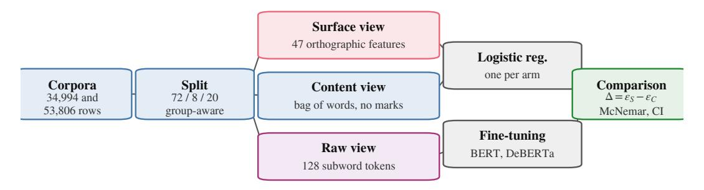
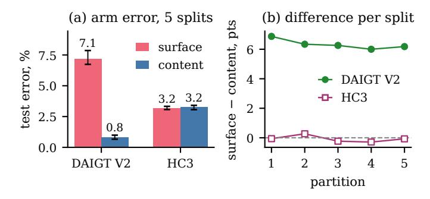

# A Surface-Content Decomposition of AI-Generated Text Detection Benchmarks

Anonymous Author(s) Affiliation withheld for double-blind review

*Abstract*—Benchmarks for machine-generated text detection report accuracy above 99%, and a detector scoring that high may have learned how machine language differs from human language, or only how one corpus was punctuated. The headline number does not separate the two, and to our knowledge no existing method reports how much of a benchmark's separability rests on surface form. This paper proposes the surfacecontent decomposition, a measurement that fits two matched classifiers over disjoint views of every document, one reading 47 orthographic features and never a word, the other reading text stripped of punctuation, casing and non-ASCII characters, with a fine-tuned transformer as reference. On HC3 the two arms are indistinguishable under a paired test at 3.20% against 3.26% error, and the null survives five of five partitions with the sign changing between them, while on DAIGT V2 content is stronger by a factor of 7.9. Subgroup analysis localises the tie rather than confirming it, since the surface arm reaches 0.01% error on the Reddit sub-corpus that is 74.8% of HC3, and removing the single cue responsible costs that arm 10.03 error points. A tokenisation control shows the cue is unnecessary in practice, because BERT cannot represent it and still reaches 0.9916 weighted F1. The measurement needs no new annotation, and reporting it beside a headline score tells a reader how much of a benchmark a model could pass without reading the language.

*Index Terms*—AI-generated text detection, benchmark evaluation, surface features, shortcut learning, tokenisation

# I. INTRODUCTION

Detectors of machine-generated text report accuracy at or above 97% on the benchmarks the field uses most, and often above 99% [\[1\]](#page-5-0), [\[2\]](#page-5-1), [\[3\]](#page-5-2). Read directly those numbers say the task is close to solved, and read carefully they say something weaker. A benchmark score measures the separability of a particular corpus rather than the capability a reader infers from it.

Separability has more than one source. A detector can reach a high score by modelling how machine-generated language differs from human language, or by modelling how one corpus was assembled, punctuated and encoded. Instances of the second kind are documented, and they include a whitespace convention in HC3 [\[4\]](#page-5-3), a length confound in the same corpus [\[5\]](#page-5-4) and prompt-specific collection shortcuts [\[6\]](#page-5-5). What is missing is a way to ask how much of a benchmark's separability owes to surface form rather than content, and to place two benchmarks on that one axis.

Three lines of prior work come close and each stops short. Shared benchmarks such as RAID [\[7\]](#page-5-6) and M4 [\[8\]](#page-5-7) make detectors comparable across conditions but do not ask what any one condition is separable by. Cleaning kits remove a single known cue [\[4\]](#page-5-3), yet a null after cleaning says nothing unless the detector could read that cue. Partial-input baselines expose artefacts in natural language inference [\[9\]](#page-5-8), [\[10\]](#page-5-9) but have not been moved to detection.

This paper proposes that measurement and compares three arms on identical splits. A *surface-only* model reads 47 orthographic features and never sees a word, a *content-only* model reads text after punctuation, casing and non-ASCII characters are stripped, and a *full* model is a fine-tuned transformer on raw text. The first two share a classifier family and are directly comparable, while the third is a reference point rather than a matched arm. The object of measurement is a corpus rather than a detector, and we offer no detector comparison, since a fair one would need matched training data on both corpora. On HC3 the two arms are indistinguishable at 3.20% against 3.26% test error, while on DAIGT V2 content is stronger by a factor of 7.9. Splitting each corpus by its own subgroup labels then shows the HC3 tie belongs to the Reddit sub-corpus that is three quarters of it. The main contributions are the following.

- A surface-content decomposition, stated formally in Section [III-D](#page-1-0) as a reusable measurement over any humanversus-machine corpus, with the length control that stops its two arms sharing a channel.
- Its application to two benchmarks and their twenty subcorpora (Sections [IV-B](#page-3-0) and [IV-C\)](#page-3-1), locating the HC3 result in one collection convention in one dominant domain, where removing that convention costs the surface arm ten points.
- A tokenisation control (Section [IV-D\)](#page-3-2) establishing that the most-discussed cue in HC3 is sufficient in isolation yet unnecessary in practice, since BERT cannot represent it and still reaches 0.9916 weighted F1 there.

The rest of this paper is organised as follows. Section [II](#page-0-0) reviews detection on these benchmarks, shortcut learning and robustness. Section [III](#page-1-1) states the problem setting, the corpora, the decomposition and the controls. Section [IV](#page-2-0) reports the measurements. Section [V](#page-4-0) discusses what they license and Section [VI](#page-4-1) concludes.

## II. RELATED WORK

Each work below is read the same way, by what it set out to solve, the methodology it proposed, how that was carried out, the result it reported, and the limitation that bears on our claim.

The corpus that set the current accuracy regime [\[1\]](#page-5-0) set out to establish whether machine answers can be told apart from human answers across several domains at once. Its methodology pairs a purpose-built corpus with detectors fitted on it. The corpus holds 85,449 question-answer rows from five sources, on which a RoBERTa classifier was fine-tuned. The document-level detector reached 99.82 F1, a regime later narrowed to roughly 91.7% under semantic-invariant tasks [2]. Its generator was collected in one window, and the score is reported without asking which property of the text carries it.

The closest prior result [4] set out to detect machine text when documents are too short for document-level evidence. It proposed a multiscale detector trained across text lengths, released with a cleaning kit for the whitespace convention it found. Its appendix carries the experiment we build on, a detector made from a single test for one token identifier. That one-token rule reached 82.12 F1 at sentence level against the 81.89 quoted there for a fine-tuned RoBERTa, and our document-level equivalent reaches 94.22 weighted F1. It removes one cue already known, so it bounds neither the separability carried by surface form in total nor how that total compares across corpora.

A third line [3] asked whether a transformer is needed on the competition-era essay benchmarks at all. Its methodology replaces fine-tuning with classical classifiers over character n-gram features, fitted and scored on DAIGT V2, reaching accuracy competitive with transformer detectors, consistent with our own tie. It is a score rather than a decomposition, so what the n-grams read is left open, as it is for work pairing stylometry with DeBERTa [11] or transformer networks [12], and the hand-crafted-versus-deep-learning comparison in [13], which still scores families rather than asking what either reads.

The shared-benchmark line [7], [8], [14] set out to make detector results comparable when generators, domains and attacks vary at once. Its methodology is a labelled benchmark, scoring a detector per condition rather than in aggregate, with splits, conditions and a leaderboard over many generators. The result is evidence on which detector rankings survive a change of condition. None of them ask what any one condition is separable by, which is the axis added here. The same blind spot is documented for vision datasets [15] and for inference models reading only the hypothesis [9], [10], [16], under the caveat [17] that a high partial-input score shows a dataset is cheatable while a low one does not.

The robustness line [18] set out to test how far a reported accuracy survives contact with a hostile writer. Its methodology perturbs inputs with misspellings and homoglyphs, then rescores HC3-trained detectors without retraining them. Under attack such a detector falls from 99.88 F1 to 33.57% accuracy, and deployed detectors flag non-native English writing as machine-generated at high rates [19]. Both report the fragility without locating what the detector relied on, which is what a decomposition supplies.

None of this work measures how much of a benchmark's separability is carried by surface form. Unlike [4], which removes one cue, and [7], [8], which compare detectors across conditions, this paper measures each corpus with two matched arms, locates the result per sub-corpus, and checks whether the detector can read the cue at all.

#### III. METHOD

#### A. Problem setting

This is a measurement contribution rather than a detector, so no baseline shares its evaluation object and the comparison below is arm against arm. The object of measurement is a corpus, and given a human-versus-machine benchmark we ask how much of its separability a model could obtain without reading the language. The instruments are two matched classifiers over disjoint views of each document, plus a fine-tuned transformer as a reference (Fig. 1). We assume balanced classes, English text and a 128-token transformer budget, and make no claim about which detector is best.

#### B. Corpora and partitioning

DAIGT V2 [20] contains 44,868 argumentative student essays, 27,371 human-written and 17,497 machine-generated by a mixture of 2023-era systems. HC3 [1] contains 85,449 question-answer rows from five English sources, contrasting human answers with GPT-3.5-Turbo. The two differ in nearly every respect that matters here, since DAIGT V2 has many generators, one genre and long documents where HC3 has one generator, five domains and short ones. Both were class-balanced by downsampling to 34,994 and 53,806 rows.

HC3 carries 6,118 duplicate rows, 7.16% of the corpus, so the split is group-aware, with documents grouped by an MD5 hash of their whitespace-normalised lowercased text and whole groups sent to one partition of a 72/8/20 division. That rule leaks 0 of 10,732 HC3 test documents against 570, or 5.30%, for a plain stratified split.

#### C. Models

Five families are evaluated. Three are classical, namely Naive Bayes, logistic regression and a linear support vector machine, each under bag-of-words and TF-IDF. Two are transformers, bert-base-uncased [21] and microsoft/deberta-v3-base [22], fine-tuned over a sixteen-run grid per dataset, learning rate  $\in \{2,3\} \times 10^{-5}$ , batch size  $\in \{16,32\}$ , weight decay  $\in \{0.01,0.1\}$ , with the operating point selected on validation weighted F1. DeBERTa's SentencePiece tokeniser [23] encodes leading whitespace and BERT's WordPiece does not, which makes the pair a controlled contrast on the cue Section IV-D examines.

#### D. The decomposition

Write x for a document and  $y \in \{0,1\}$  for its label, with 1 denoting machine-generated. The surface map  $\phi_S$  sends a document to  $\mathbb{R}^{47}$ , a vector of orthographic statistics covering punctuation, whitespace behaviour including spaces before punctuation, casing, length, non-ASCII and digit rates, and it reads no word identity. The content map  $\phi_C$  lowercases, replaces every character outside the lowercase Latin alphabet and whitespace with a space, collapses whitespace runs, then takes raw bag-of-words counts. Punctuation, casing and non-ASCII cannot enter it.

Fig. 1. The measurement pipeline and its three disjoint views.

Each arm fits one logistic regression on the same training partition,

$$h_a = \arg\min_{h} \sum_{(x,y)\in\mathcal{D}_{tr}} \ell(h(\phi_a(x)), y) + \frac{1}{2C} ||h||_2^2,$$
 (1)

for a ∈ {S, C}, with C = 1.0, scikit-learn's default, for both. Sharing the classifier family and the regularisation is what makes the two arms comparable. We report the held-out error εa of each arm and the gap ∆ = εS − εC, where a gap near zero says orthography alone reaches the accuracy of content alone. The comparison is between two specific arms rather than a partition of the total separability.

One channel reaches both arms, since the surface arm reads size counts directly and raw bag-of-words rows sum to document length. Length is a documented confound on both corpora [\[5\]](#page-5-4), so we drop the five size-scaling surface features and normalise content rows to unit total before rescaling by the mean training document length. That rescaling matters, because rows summing to one shrink every feature and the arm would otherwise collapse for reasons of scale rather than length.

## *E. Evaluation metrics*

Models are scored by weighted F1 and by test error. Both are reported because the corpora are balanced by construction, so the two move together, while weighted F1 keeps our numbers comparable with the published detectors of Section [II.](#page-0-0) The decomposition is read from the gap between two error rates rather than from either alone, since the question is which view of a document carries the separability.

#### *F. Statistics and controls*

Transformer baselines are read from the deployed checkpoint's own record rather than from a grid maximum, with paired comparisons on the same test set. Writing b and c for the discordant counts, we report the exact two-sided binomial p-value [\[24\]](#page-5-23) with a paired bootstrap 95% interval on the error difference over 10,000 resamples [\[25\]](#page-5-24), resampling document indices so the pairing is preserved. A bootstrap says nothing about how the corpus was partitioned and the central claim here is a null, so the decomposition is repeated over five group-aware partitions varying only the split seed. We run no parametric tests at n ≤ 30.

TABLE I TEST ERROR FOR ALL EIGHT CONFIGURATIONS. BOLD MARKS THE BEST PER CORPUS.

| Model         | Rep.   | DAIGT V2 err % | HC3 err % |  |
|---------------|--------|----------------|-----------|--|
| Naive Bayes   | BoW    | 4.09           | 12.87     |  |
| Naive Bayes   | TF-IDF | 4.23           | 13.28     |  |
| Logistic Reg. | BoW    | 1.07           | 4.49      |  |
| Logistic Reg. | TF-IDF | 1.43           | 6.35      |  |
| SVM           | BoW    | 1.30           | 5.25      |  |
| SVM           | TF-IDF | 0.90           | 5.51      |  |
| BERT          | raw    | 0.84           | 0.84      |  |
| DeBERTa       | raw    | 0.83           | 0.28      |  |

Two controls guard the claims below. A *tokenisation* control compares token identifier sequences for minimally different strings, since whether a detector can exploit a character-level cue is a property of its tokeniser. A *pipeline-fires* control confirms that a cleaning step reporting no change actually executed, by applying the same pipeline where the step removes something the tokeniser can represent.

## *G. Reproducibility*

Partitions are built once at split seed 42 and reused by every model and training seed, so only initialisation and batch order vary between runs. The four deployed checkpoints were retrained at seeds 123 and 456. Fine-tuning ran three epochs at a 128-token budget on one 8 GiB NVIDIA GeForce RTX 3060 Ti, the longest run taking 1,111 seconds, under PyTorch 2.11, Transformers 4.57 and scikit-learn 1.9. The split seed, the grid above and this hardware are the reproducibility record this paper can give under double-blind review, and code and per-run logs will be released at camera-ready.

#### IV. RESULTS AND ANALYSIS

Every number below comes from the group-aware split of Section [III,](#page-1-1) reused by every model, with transformers finetuned for three epochs at a 128-token budget on one 8 GiB GPU. To the best of our knowledge this is the first surfacecontent decomposition reported for either corpus, so Table [IV](#page-4-2) places our detectors beside the published numbers instead.

*A. A classical model matches a transformer on DAIGT V2 until the text budget is matched*

Table [I](#page-2-2) reports every configuration, and the two benchmarks part company. On DAIGT V2 the best classical configuration

TABLE II THE MATCHED TEXT BUDGET. ERRORS ARE PERCENTAGES.

| Corpus   | Window  | kept  | full | window | transf. | difference        |
|----------|---------|-------|------|--------|---------|-------------------|
| DAIGT V2 | BERT    | 33.5% | 0.90 | 2.10   | 0.84    | +1.26 (0.90–1.63) |
| DAIGT V2 | DeBERTa | 34.1% | 0.90 | 2.09   | 0.83    | +1.26 (0.90–1.61) |
| HC3      | BERT    | 74.6% | 4.49 | 5.66   | 0.84    | +4.82 (4.37–5.26) |
| HC3      | DeBERTa | 75.6% | 4.49 | 5.72   | 0.28    | +5.44 (5.01–5.89) |

TABLE III DECOMPOSITION PER CORPUS, THEN HC3 BY DOMAIN. BOLD MARKS THE LOWER ERROR.

| Arm                        | DAIGT V2 err % | HC3 err % |
|----------------------------|----------------|-----------|
| surface-only               | 7.86           | 3.20      |
| content-only               | 0.99           | 3.26      |
| full transformer           | 0.83           | 0.28      |
| length-only (3 feats)      | 24.59          | 15.23     |
| surface-only, no length    | 9.93           | 3.37      |
| content-only, length-norm. | 0.94           | 6.28      |

|             |       | surface | content | cue present in |         |
|-------------|-------|---------|---------|----------------|---------|
| HC3 domain  | n     | err %   | err %   | human          | machine |
| reddit eli5 | 6,690 | 0.01    | 2.66    | 98.9%          | 0.3%    |
| finance     | 684   | 7.60    | 3.07    | 5.6%           | 0.1%    |
| medicine    | 250   | 4.00    | 0.40    | 17.0%          | 0.1%    |
| open qa     | 198   | 4.04    | 5.05    | 60.7%          | 0.4%    |
| wiki csai   | 168   | 5.36    | 11.90   | 1.6%           | 0.2%    |

open qa and wiki csai fall below 200 test rows.

sits 0.07 points above the best transformer. The two disagree on 99 documents split 47 to 52, so McNemar returns p = 0.69 and the paired interval, [−0.21, +0.34] points, contains zero. On HC3 the same comparison gives 484 discordant cases split 16 to 468 at p < 10−6 , with an error difference of +4.21 points. Reseeding the four checkpoints at 123 and 456 moves them by 0.0005 to 0.0036 weighted F1, and the DAIGT V2 pair overlap where the HC3 pair do not. The eight classical configurations carry no such range, because each is fit with a fixed random state on the fixed split and has no seed to vary, unlike the transformers' initialisation and batch order.

That tie is also not a matched comparison, since the classical models read whole documents while the transformers read 128 tokens. We therefore refit the classical grid on the exact character span each tokeniser kept, taken from offset mapping. Held to one text budget the transformers lead on both corpora and every interval in Table [II](#page-3-3) excludes zero, so the unmatched tie was a fact about information access rather than architecture.

## *B. On HC3, orthography alone matches content alone*

Table [III](#page-3-4) gives the decomposition. On HC3 the two arms are indistinguishable at 3.20% error from orthography against 3.26% from content. They disagree on 625 documents split 316 to 309, so McNemar returns p = 0.81 and the difference is −0.07 points with interval [−0.52, +0.40]. On DAIGT V2 the same arms separate by a factor of 7.9, 7.86% against 0.99%, with 569 discordant documents split 44 to 525 at p < 10−6 .

The content arm is deliberately unfiltered, since refitting it with the stopword removal and lemmatisation of the classical pipeline makes the HC3 filtered arm lose to orthography by 1.30 points where the unfiltered arm ties it. We report the stronger opponent because it makes the parity claim harder.

Surface form is informative on both benchmarks, since DAIGT V2's surface arm reaches 0.9214 weighted F1, so the finding is not that one corpus is clean but that only on HC3 does surface rise to parity with content. Closing the length channel widens DAIGT V2's content advantage from 7.9 to 10.6 times and turns HC3's parity into a 2.91-point advantage for orthography. A null on one partition is what a lucky split manufactures, so the decomposition runs again over five group-aware partitions. Content leads on DAIGT V2 on all five at p < 10−6 , while on HC3 the difference reaches significance on none, with p of 0.81, 0.27, 0.34, 0.23 and 0.78, and it changes sign between them. That is the strong form of the null, since an underpowered real difference keeps its sign, and the five differences average −0.08 points and range from −0.29 to +0.27, straddling zero rather than clustering on one side. Tuning regularisation per arm on validation changes no conclusion, since the HC3 arms move to 3.15% and 3.47% error and stay indistinguishable on all five.

#### *C. The parity belongs to one sub-domain and one cue*

Both corpora carry subgroup labels, so the lower half of Table [III](#page-3-4) runs the same measurement per HC3 domain. On reddit\_eli5 the surface arm reaches 0.01% error, roughly one mistake in 6,690 documents. On the two other domains with enough test rows the ordering reverses, and content wins by 4.53 points on finance with interval [+2.34, +6.87] and by 3.60 on medicine with interval [+1.60, +6.00]. Since reddit\_eli5 is 74.8% of the balanced corpus, the corpuslevel parity is substantially that one domain.

The mechanism is measured. The space-before-punctuation cue appears in 98.9% of reddit\_eli5 human documents against 0.3% of machine ones, decaying to 1.6% on wiki\_csai. A boolean rule treating a document as human when the cue is present scores 94.23% accuracy on the balanced corpus, 94.22 weighted F1, where the sentence-level equivalent in [\[4\]](#page-5-3) reaches 82.12 F1. Applying that work's cleaning kit changes 44.5% of HC3 documents and moves the surface arm from 3.20% to 13.22% error, a loss of 10.03 points with interval [−10.69, −9.38], while the content arm is untouched at 3.26%.

The same treatment on DAIGT V2 pairs each generator against the shared human pool. Content wins on every generator, while the surface arm's error spans sixteenfold across the ten generators with enough test rows, from 0.50% to 8.13%. Two pairs of the same underlying model contributed by different people differ by factors of 4.1 and 2.3, which we report as suggestive, since the smaller member of each pair holds 184 and 130 test rows.

## *D. A model that cannot represent the cue reaches 0.9916 anyway*

The natural inference is that HC3-trained detectors exploit the cue, but the test does not support it. BERT's WordPiece splits on punctuation irrespective of adjacent whitespace, emitting identical identifiers for "the answer is simple ." and "the answer is simple." in three of three

Fig. 2. Arm error and the per-split difference. Filled marks a significant surface-vs-content difference (p < 0.05).

 $\label{thm:conditional} \textbf{TABLE IV} \\ \textbf{PUBLISHED NUMBERS ON THESE CORPORA, AND WHY EACH DIFFERS.} \\$ 

| Detector           | Corpus   | wtd. F1       | why it is not like-for-like   |
|--------------------|----------|---------------|-------------------------------|
| RoBERTa [1]        | HC3      | 0.9982        | authors' own split            |
| One-token rule [4] | HC3      | 0.8212        | per sentence, not document    |
| Released [27]      | HC3      | 0.9952        | our test rows in its training |
| Released [27]      | DAIGT V2 | 0.8230        | unseen corpus, 512 tokens     |
| DeBERTa, ours      | HC3      | <b>0.9972</b> | in-domain, 128 tokens         |
| DeBERTa, ours      | DAIGT V2 | <b>0.9917</b> | in-domain, 128 tokens         |

pairs tested, where DeBERTa's SentencePiece distinguishes all three. BERT cannot represent the cue and still reaches 0.9916 weighted F1 on HC3, so the cue is sufficient in isolation and unnecessary in practice.

This is why removing the cue changes nothing for BERT. Whitespace cleaning on HC3 yields predictions bit-identical to the uncleaned run, indistinguishable from a step that never executed, whereas the same pipeline on DAIGT V2, where it also removes emoji, does change them, so the pipeline fires and the null is specific to whitespace. We do not attribute the BERT-to-DeBERTa difference to this cue, since the two models differ in tokeniser, architecture, pretraining corpus and parameter count. Fig. 2 shows both arms per corpus and the difference on each partition.

#### E. Neither corpus transfers to the other

Each deployed checkpoint was also evaluated on the corpus it was not trained on, without adaptation, and every cell loses between 0.0833 and 0.2019 mean weighted F1 over three seeds. Trained on DAIGT V2, BERT falls from 0.9921 to 0.7902 and DeBERTa from 0.9930 to 0.9096, while trained on HC3 they fall to 0.8311 and 0.8512. Much of what each model learned is specific to the corpus it was fitted to, consistent with confounds documented directly in detector generalisation [26].

## F. A published detector out of domain

Every model above is one we trained, so the RoBERTa detector released with HC3 [27] gives an external reference point, run over the same partitions without fine-tuning. Table IV places it beside the published figures and our own, and its 17.55% error on an unseen corpus bounds how far the 99.82 F1 of Section II travels untuned.

## V. DISCUSSION

The decomposition separates two benchmarks that a headline accuracy figure does not, and applied per sub-corpus it separates one benchmark from itself, since on HC3 orthography alone matches content alone on all five partitions while on DAIGT V2 content is stronger by a factor of 7.9. Section IV-C narrows the first of those to one collection convention in the Reddit sub-corpus that is three quarters of the corpus, and removing that convention costs the surface arm ten points. A single collection convention can be cleaned, whereas the diffuse stylistic signal DAIGT V2's surface arm reads has no equivalent single cleaning step in our experiments, and may not be an artefact.

What the measurement does not license is a claim that either corpus is clean, since DAIGT V2's surface arm reaches 0.9214 weighted F1 and surface form is therefore substantially informative on both. The reason a low surface score would not have settled the question either is given in [17], so the finding is comparative and bounded by the arms we built.

A second reading places the measurement against generator provenance rather than model identity. On DAIGT V2 the surface arm's error spans sixteenfold across generators, and two pairs of the same model contributed by different people differ by factors of 4.1 and 2.3, pointing at collection rather than at what produced it.

Two results here say more about method than about these corpora, since a cleaning experiment reporting no change is uninterpretable without evidence the pipeline ran, and a tokeniser that cannot represent a cleaned cue makes the null a fact about the model, not the corpus.

The practical use is a pre-release check rather than a detector, since a benchmark builder can run both arms before release and report the gap beside the headline score for two logistic regressions. The arms also mark where a detector should not be trusted, because a score earned on the Reddit sub-corpus does not carry to the rest of HC3. The gap against the released detector in Table IV is a training-data effect, since that model reads more tokens than ours and still loses 17.55 points off its own corpus.

Several limits bound every number above. The transformers see at most 128 tokens, so the DAIGT V2 results describe an essay's opening, which is why the classical comparison repeats on that span in Table II. The four checkpoints move by 0.0005 to 0.0036 weighted F1 across three seeds, but the grid behind them is single-seed. The content arm is bag-of-words, so word order lies outside it, and the 47 hand-built surface features make  $\varepsilon_{\rm S}$  an upper bound, not a measurement of what orthography could carry. Seven of the twenty sub-corpora fall below 200 test rows and are reported as underpowered, not as nulls. HC3 has one generator collected at one time, and both corpora are English, so these orthographic conventions are not language-independent.

## VI. CONCLUSION

The measurement itself is the portable part of this work, since it needs no new annotation and fits two logistic regressions. It yields one number per corpus, and per sub-corpus, that a headline accuracy cannot express, namely how much of a corpus a model could pass without reading the language.

We encourage reporting it alongside any new detection benchmark. Three extensions follow directly. The first is to run the decomposition per condition on RAID, M4 and SemEval-2024 Task 8, which already carry the labels it needs. The second is to repeat the transformer comparison at a 512-token budget, so the DAIGT V2 results describe whole essays. The third is to test a non-English corpus, where the conventions measured here need not hold.

## REFERENCES

- [1] B. Guo, X. Zhang, Z. Wang, M. Jiang, J. Nie, Y. Ding, J. Yue, and Y. Wu, "How close is chatgpt to human experts? comparison corpus, evaluation, and detection," 2023, preprint. [Online]. Available: [https://www.semanticscholar.org/paper/](https://www.semanticscholar.org/paper/cb29cf52f0f7d2e4324c68690a55b22890f2212d) [cb29cf52f0f7d2e4324c68690a55b22890f2212d](https://www.semanticscholar.org/paper/cb29cf52f0f7d2e4324c68690a55b22890f2212d)
- [2] Z. Su, X. Wu, W. Zhou, G. Ma, and S. Hu, "Hc3 plus: A semantic-invariant human chatgpt comparison corpus," 2023, preprint. [Online]. Available: [https://www.semanticscholar.org/paper/](https://www.semanticscholar.org/paper/ff7ee54876220ccf425050a14f14bb9893849f05) [ff7ee54876220ccf425050a14f14bb9893849f05](https://www.semanticscholar.org/paper/ff7ee54876220ccf425050a14f14bb9893849f05)
- [3] C. Zhou, "Exploiting machine learning model ensemble for AIgenerated texts detection," *Transactions on Computer Science and Intelligent Systems Research*, vol. 5, 2024, aIDML 2024. [Online]. Available: <https://wepub.org/index.php/TCSISR/article/view/2382>
- [4] Y. Tian, H. Chen, X. Wang, Z. Bai, Q. Zhang, R. Li, C. Xu, and Y. Wang, "Multiscale positive-unlabeled detection of AI-generated texts," in *Proc. Int. Conf. Learning Representations (ICLR)*, 2024. [Online]. Available: <https://openreview.net/forum?id=5Lp6qU9hzV>
- [5] M. S. Baidya, S. S. Baidya, and C. Chawla, "Detecting the machine: A comprehensive benchmark of AI-generated text detectors across architectures, domains, and adversarial conditions," 2026, preprint. [Online]. Available: [https://www.researchgate.net/publication/](https://www.researchgate.net/publication/402739141) [402739141](https://www.researchgate.net/publication/402739141)
- [6] C. Park, H. J. Kim, J. Kim, Y. Kim, T. Kim, H. Cho, H. Jo, S. goo Lee, and K. M. Yoo, "Investigating the influence of prompt-specific shortcuts in AI generated text detection," 2024, preprint. [Online]. Available: [https://www.semanticscholar.org/paper/](https://www.semanticscholar.org/paper/c860cd15c192b54bc94ac927ba99e0f3d562bd86) [c860cd15c192b54bc94ac927ba99e0f3d562bd86](https://www.semanticscholar.org/paper/c860cd15c192b54bc94ac927ba99e0f3d562bd86)
- [7] L. Dugan, A. Hwang, F. Trhl´ık, A. Zhu, J. M. Ludan, H. Xu, D. Ippolito, and C. Callison-Burch, "RAID: A shared benchmark for robust evaluation of machine-generated text detectors," in *Proc. ACL*, 2024, pp. 12 463–12 492. [Online]. Available: [https:](https://doi.org/10.18653/v1/2024.acl-long.674) [//doi.org/10.18653/v1/2024.acl-long.674](https://doi.org/10.18653/v1/2024.acl-long.674)
- [8] Y. Wang, J. Mansurov, P. Ivanov, J. Su, A. Shelmanov, A. Tsvigun, C. Whitehouse, O. Mohammed Afzal, T. Mahmoud, T. Sasaki, T. Arnold, A. F. Aji, N. Habash, I. Gurevych, and P. Nakov, "M4: Multi-generator, multi-domain, and multi-lingual black-box machinegenerated text detection," in *Proc. EACL*, 2024, pp. 1369–1407. [Online]. Available: <https://doi.org/10.18653/v1/2024.eacl-long.83>
- [9] S. Gururangan, S. Swayamdipta, O. Levy, R. Schwartz, S. R. Bowman, and N. A. Smith, "Annotation artifacts in natural language inference data," in *Proc. NAACL-HLT*, 2018, pp. 107–112. [Online]. Available: <https://doi.org/10.18653/v1/N18-2017>
- [10] A. Poliak, J. Naradowsky, A. Haldar, R. Rudinger, and B. Van Durme, "Hypothesis only baselines in natural language inference," in *Proc. Joint Conf. on Lexical and Computational Semantics (\*SEM)*, 2018, pp. 180–191. [Online]. Available: <https://doi.org/10.18653/v1/S18-2023>
- [11] A. Yadagiri, S. Sai Teja, P. Pakray, and C. Chunka, "AI-generated text detection using DeBERTa with auxiliary stylometric features," in *Proceedings of the RANLP 2025 Workshop on Multi-Domain Detection of AI-Generated Text (M-DAIGT)*, 2025. [Online]. Available: <https://aclanthology.org/2025.ranlp-mdaigt.2/>
- [12] Y. Annepaka, P. Kumar, Y. Poddar, P. Pakray, and C. Chunka, "Synergizing linguistic features and transformer networks for detecting AI-generated text," *Knowledge and Information Systems*, vol. 68, no. 1, 2026. [Online]. Available: <https://doi.org/10.1007/s10115-025-02637-6>
- [13] R. Ardeshirifar, "Comparing hand-crafted and deep learning approaches for detecting AI-generated text: performance, generalization, and linguistic insights," *AI and Ethics*, vol. 5, no. 4, pp. 4197–4209, 2025. [Online]. Available: <https://doi.org/10.1007/s43681-025-00699-4>

- [14] Y. Wang, J. Mansurov, P. Ivanov, J. Su, A. Shelmanov, A. Tsvigun, O. M. Afzal, T. Mahmoud, G. Puccetti, T. Arnold, A. F. Aji, N. Habash, I. Gurevych, and P. Nakov, "SemEval-2024 task 8: Multidomain, multimodel and multilingual machine-generated text detection," in *Proc. 18th Int. Workshop on Semantic Evaluation (SemEval-2024)*, 2024, pp. 2057–2079. [Online]. Available: [https:](https://doi.org/10.18653/v1/2024.semeval-1.279) [//doi.org/10.18653/v1/2024.semeval-1.279](https://doi.org/10.18653/v1/2024.semeval-1.279)
- [15] A. Torralba and A. A. Efros, "Unbiased look at dataset bias," in *Proc. IEEE Conf. Computer Vision and Pattern Recognition (CVPR)*, 2011, pp. 1521–1528. [Online]. Available: [https://doi.org/10.1109/](https://doi.org/10.1109/CVPR.2011.5995347) [CVPR.2011.5995347](https://doi.org/10.1109/CVPR.2011.5995347)
- [16] R. Geirhos, J.-H. Jacobsen, C. Michaelis, R. Zemel, W. Brendel, M. Bethge, and F. A. Wichmann, "Shortcut learning in deep neural networks," *Nature Machine Intelligence*, vol. 2, no. 11, pp. 665–673, 2020. [Online]. Available: <https://doi.org/10.1038/s42256-020-00257-z>
- [17] S. Feng, E. Wallace, and J. Boyd-Graber, "Misleading failures of partial-input baselines," in *Proc. ACL*, 2019, pp. 5533–5538. [Online]. Available: <https://doi.org/10.18653/v1/P19-1554>
- [18] W. Antoun, V. Mouilleron, B. Sagot, and D. Seddah, "Towards a robust detection of language model-generated text: Is ChatGPT that easy to detect?" in *Actes de CORIA-TALN 2023, Vol. 1: Travaux de Recherche Originaux, Articles Longs*, Paris, France, 2023, pp. 14–27. [Online]. Available: <https://aclanthology.org/2023.jeptalnrecital-long.2/>
- [19] W. Liang, M. Yuksekgonul, Y. Mao, E. Wu, and J. Zou, "GPT detectors are biased against non-native English writers," *Patterns*, vol. 4, no. 7, p. 100779, 2023. [Online]. Available: [https://doi.org/10.1016/j.patter.](https://doi.org/10.1016/j.patter.2023.100779) [2023.100779](https://doi.org/10.1016/j.patter.2023.100779)
- [20] thedrcat, "DAIGT v2 train dataset," Kaggle, 2023. [Online]. Available: <https://www.kaggle.com/datasets/thedrcat/daigt-v2-train-dataset>
- [21] J. Devlin, M.-W. Chang, K. Lee, and K. Toutanova, "BERT: Pretraining of deep bidirectional transformers for language understanding," in *Proc. NAACL-HLT*, 2019, pp. 4171–4186. [Online]. Available: <https://doi.org/10.18653/v1/N19-1423>
- [22] P. He, J. Gao, and W. Chen, "DeBERTaV3: Improving DeBERTa using ELECTRA-style pre-training with gradient-disentangled embedding sharing," in *Proc. Int. Conf. Learning Representations (ICLR)*, 2023. [Online]. Available: <https://openreview.net/forum?id=sE7-XhLxHA>
- [23] T. Kudo and J. Richardson, "SentencePiece: A simple and language independent subword tokenizer and detokenizer for neural text processing," in *Proc. EMNLP: System Demonstrations*, 2018, pp. 66–71. [Online]. Available: <https://doi.org/10.18653/v1/D18-2012>
- [24] Q. McNemar, "Note on the sampling error of the difference between correlated proportions or percentages," *Psychometrika*, vol. 12, no. 2, pp. 153–157, 1947. [Online]. Available: [https://doi.org/10.1007/](https://doi.org/10.1007/BF02295996) [BF02295996](https://doi.org/10.1007/BF02295996)
- [25] B. Efron, "Bootstrap methods: Another look at the jackknife," *The Annals of Statistics*, vol. 7, no. 1, pp. 1–26, 1979. [Online]. Available: <https://doi.org/10.1214/aos/1176344552>
- [26] C. Borile and C. Abrate, "How to generalize the detection of AIgenerated text: Confounding neurons," in *Findings of the Association for Computational Linguistics: EMNLP 2025*, 2025, pp. 25 461–25 476. [Online]. Available: [https://aclanthology.org/2025.findings-emnlp.1388.](https://aclanthology.org/2025.findings-emnlp.1388.pdf) [pdf](https://aclanthology.org/2025.findings-emnlp.1388.pdf)
- [27] "ChatGPT detector, RoBERTa," Hugging Face Models, 2023. [Online]. Available: [https://huggingface.co/Hello-SimpleAI/](https://huggingface.co/Hello-SimpleAI/chatgpt-detector-roberta) [chatgpt-detector-roberta](https://huggingface.co/Hello-SimpleAI/chatgpt-detector-roberta)