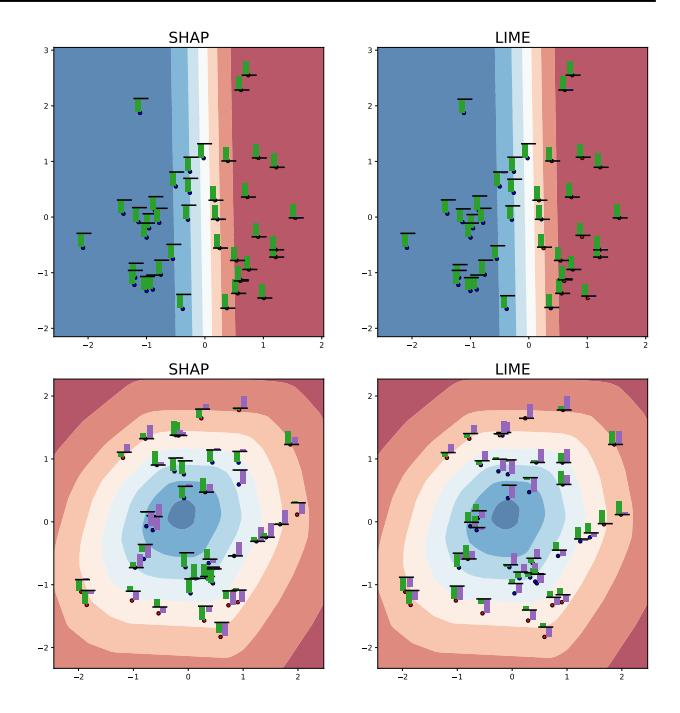
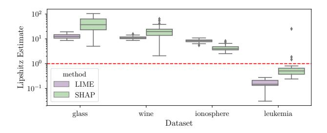
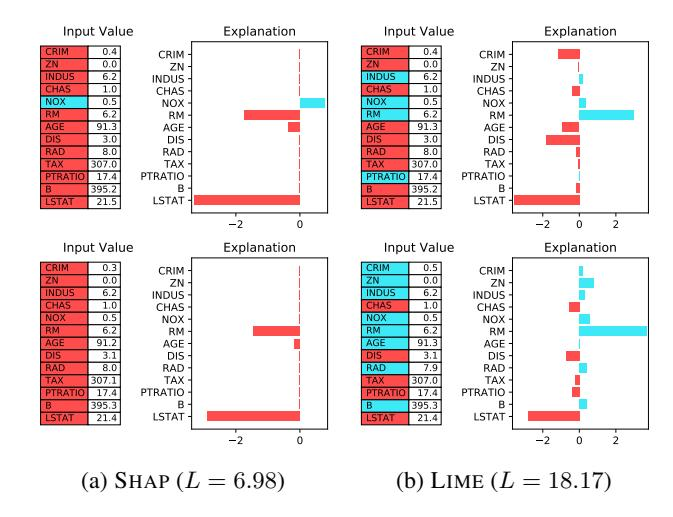
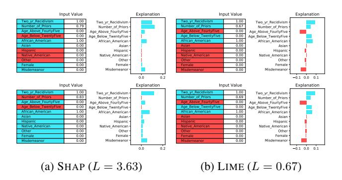
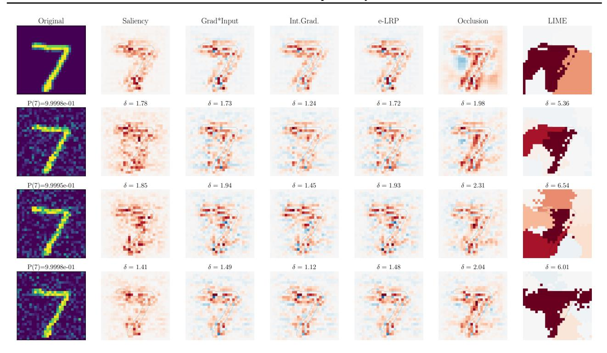
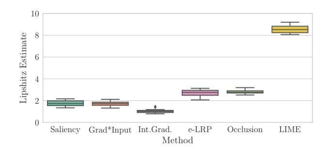
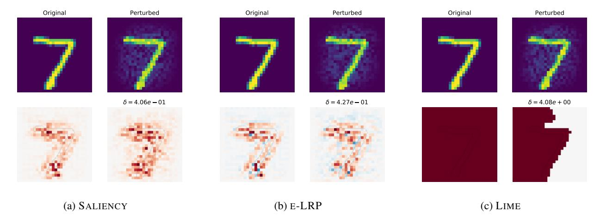
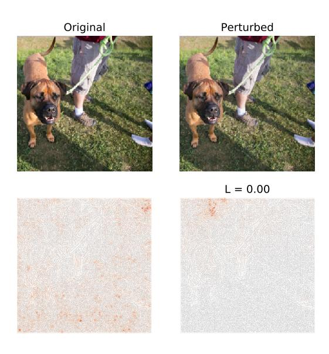

# On the Robustness of Interpretability Methods

#### David Alvarez-Melis 1 Tommi S. Jaakkola 1

### Abstract

We argue that robustness of explanations—i.e., that similar inputs should give rise to similar explanations—is a key desideratum for interpretability. We introduce metrics to quantify robustness and demonstrate that current methods do not perform well according to these metrics. Finally, we propose ways that robustness can be enforced on existing interpretability approaches.

## 1. Introduction

Most current methods for interpreting complex models are *prediction-based*, i.e., they operate at the level of a single individual input/prediction pair, producing an explanation for why the model predicted that output for that particular input. These methods and can be roughly divided into two categories: saliency and perturbation approaches. Methods in the former category use signal from gradients or output decomposition to infer salient features [\(Selvaraju](#page-5-0) [et al.,](#page-5-0) [2017;](#page-5-0) [Simonyan et al.,](#page-5-0) [2014\)](#page-5-0). On the other hand, perturbation-based methods rely on querying the model around the prediction of interest to infer relevance of input features towards the output [\(Ribeiro et al.,](#page-5-0) [2016;](#page-5-0) [Alvarez-](#page-5-0)[Melis & Jaakkola,](#page-5-0) [2017\)](#page-5-0).

Such saliency and perturbation methods offer many desirable properties: they have simple formulations, require little (or no) modification to the model being explained, and some of them are derived axiomatically [\(Lundberg & Lee,](#page-5-0) [2017\)](#page-5-0). Yet, these methods in their current form have important limitations too. For example, [Kindermans et al.](#page-5-0) [\(2017\)](#page-5-0) showed that most saliency methods are not invariant under simple transformations of the input, and are very sensitive to the choice of reference point.

Another, more general, argument commonly used against prediction-based interpretability methods is that 'understanding' a complex model with a single point-wise explanation is perhaps too optimistic, if not naive. Indeed,

*2018 ICML Workshop on Human Interpretability in Machine Learning (WHI 2018)*, Stockholm, Sweden. Copyright by the author(s).

the insight gained from a single attribution or saliency map might be too brittle, and lead to a false sense of understanding. One way to address this limitation would be to go beyond points and examine the behavior of the model in a neighborhood of the point of interest.

In light of this, here we argue that a crucial property that interpretability methods should satisfy to generate meaningful explanations is *robustness* to local perturbations of the input. In its most intuitive form, such a requirement states that similar inputs should not lead to substantially different explanations. There are two main arguments for why robustness is a crucial property that interpretability methods should strive for. First, in order for an explanation to be valid around a point, it should remain roughly constant in its vicinity, regardless of how it is expressed (e.g., as saliency, decision tree, or linear model). On the other hand, if we seek an explanation that can be applied in a predictive sense around the point of interest as described above, then robustness of the simplified model implies that it can be approximately used *in lieu* of the true complex model, at least in a small neighborhood.

In this context, the purpose of this work is to investigate whether popular gradient and perturbation-based interpretability methods satisfy robustness. For this, we first formalize the intuitive notion of robustness that we seek in the next section. Then, in Section 3, we show how various popular interpretability methods fare with respect to these metrics in various experimental settings. Finally, in Section 4 we summarize our findings and discuss approaches to enforce robustness in interpretability methods.

## 2. Robustness

The notion of robustness we seek concerns variations of a prediction's "explanation" with respect to changes in the input leading to that prediction. Intuitively, if the input being explained is modified slightly—subtly enough so as to not change the prediction of the model too much—then we would hope that the explanation provided by the interpretability method for that new input does not change much either. The first important takeaway from this work—and its main motivation—is that this is not the case for most current interpretability methods. Figure [1](#page-1-0) shows the explanations provided by two popular such perturbation-based

1MIT Computer Science and Artificial Intelligence Lab. Correspondence to: David Alvarez-Melis <dalvmel@mit.edu>.

methods, LIME (Ribeiro et al., 2016) and SHAP (Lundberg & Lee, 2017), for the predictions of two classifiers on a synthetic two-dimensional dataset. As expected, their predictions are fairly stable when explaining a linear SVM classifier (top row), but for a more complex model (a neural network classifier, shown in the bottom row), they yield explanations that vary considerably for some neighboring inputs, and are often inconsistent with each other.

The instability portrayed in Figure 1 is the phenomenon we seek to investigate. Visual inspection of attributions, although illustrative, is subjective and infeasible for higherdimensional inputs. To conclusively gauge this (lack of) robustness, we need objective tools to quantify it. Calculus puts multiple notions of function stability at our disposal, among which is Lipschitz continuity, a parametric notion of stability that measures relative changes in the output with respect to the input. Note, however, that the usual definition on Lipschitz continuity is global, i.e., it looks for largest relative deviations throughout the input space. In the context of interpretability, such a notion is not meaningful since there is no reason to expect explanation uniformity for very distant inputs. Instead, we are interested in a local notion of stability, i.e., for neighboring inputs. Thus, we propose to rely on the point-wise, neighborhood-based local Lipschitz continuity: 1

**Definition 2.1.** 
$$f: \mathcal{X} \subseteq \mathbb{R}^n \to \mathbb{R}^m$$
 is locally Lipschitz if for every  $x_0$  there exist  $\delta > 0$  and  $L \in \mathbb{R}$  such that  $\|x - x_0\| < \delta$  implies  $\|f(x) - f(x_0)\| \le L\|x - x_0\|$ .

As opposed to the (global) Lipschitz criterion, here both  $\delta$  and L depend on the anchor point  $x_0$ . Armed with this notion, we can quantify the robustness of an explanation model f in terms of its constant L in Definition 2.1. Naturally, this quantity is rarely known a-priori, and thus has to be estimated. A straightforward way to do so involves solving, for every point  $x_i$  of interest, an optimization problem:

$$\hat{L}(x_i) = \underset{x_j \in B_{\epsilon}(x_i)}{\operatorname{argmax}} \frac{\|f(x_i) - f(x_j)\|_2}{\|x_i - x_j\|_2}$$
(1)

where  $N_{\epsilon}(x_i)$  is a ball of radius  $\epsilon$  centered at  $x_i$ .2 Computing this quantity is a challenging problem by itself. For our setting, most functions f of interest (i.e., interpretability methods) are not end-to-end differentiable, so computing gradients with respect to inputs (e.g., for gradient ascent) is not possible. In addition, evaluations of f are computationally expensive, so (1) must be estimated with a restricted evaluation budget. There are various off-the-shelf methods for such black-box optimization, for instance Bayesian Optimization (Snoek et al., 2012, and references therein).

Figure 1: LIME and SHAP explanations for two simple binary classifiers: a linear SVM (top row) and a two-layer neural network (bottom). The heatmaps depict the models' positive-class probability level sets, and the barchart inserts show the interpreters' explanations (attribution values for  $\boldsymbol{x}$  in green and  $\boldsymbol{y}$  in purple) for test point predictions. While both LIME and SHAP's explanations for the linear model are stable, for the non-linear model (bottom) they vary significantly within small neighborhoods.

The *continuous* notion of local stability described above might not be suitable for models with discrete inputs or those where adversarial perturbations are overly restrictive (e.g., when the true data manifold has regions of flatness in some dimensions). In such cases, we can instead define a (weaker) empirical notion of stability based on discrete, finite-sample neighborhoods, as implied by the examples in the test data of interest. Let  $X = \{x_i\}_{i=1}^n$  denote a sample of input examples. Define, for every  $x_i \in X$ ,

$$\mathcal{N}_{\epsilon}(x_i) = \{ x_i \in X \mid ||x_i - x_i|| \le \epsilon \}$$

The notion of interest is then

$$\tilde{L}_X(x_i) = \underset{x_j \in \mathcal{N}_{\epsilon}(x_i) \le \epsilon}{\operatorname{argmax}} \frac{\|f(x_i) - f(x_j)\|_2}{\|x_i - x_j\|_2}$$
 (2)

Computation of this quantity, unlike (1), is trivial since it operates only over the (finite) test set X.

Although both (1) and (2) are unitless quantities, there is no single "ideal" value that is universally desirable. Instead, what is *reasonable* will depend on the application and goal of interpretability (see §4). Here, we interpret these quantities relatively, comparing them across different methods.

&lt;sup>1This notion has been also used for adversarial attacks on neural networks(Hein & Andriushchenko, 2017; Weng et al., 2018)

&lt;sup>2Naturally, optimizing over  $l_{\infty}$  box constraints is much easier, and thus we take this approach in our experiments.

Figure 2: Local Lipschitz estimates [\(1\)](#page-1-0) computed on 100 test points on various UCI classification datasets.

### 3. Experiments

### 3.1. Methods and Datasets

In addition to the aforementioned LIME and SHAP, we compare the following interpretability methods:

- SALIENCY maps [\(Simonyan et al.,](#page-5-0) [2014\)](#page-5-0).
- GRADIENT\*INPUT [\(Shrikumar et al.,](#page-5-0) [2016\)](#page-5-0).
- INTegrated GRADients [\(Sundararajan et al.,](#page-5-0) [2017\)](#page-5-0).
- -Layerwise Relevance Propagation [\(Bach et al.,](#page-5-0) [2015\)](#page-5-0).
- OCCLUSION sensitivity [\(Zeiler & Fergus,](#page-5-0) [2014\)](#page-5-0).

We used author implementations of LIME and SHAP and the DeepExplain3 toolbox for the rest. All these methods return attribution arrays, which we treat as the vectorvalued f(x) in [\(1\)](#page-1-0) and [\(2\)](#page-1-0). We compute the latter using Bayesian optimization with the skopt4 toolbox, using a budget of 200 function calls (only 40 for LIME/SHAP due to higher compute time). We use = 0.1 in [\(1\)](#page-1-0) and [\(2\)](#page-1-0).

We test these methods on various dataset/prediction model settings. First, we experiment with explaining black-box classifiers on standard machine learning datasets from the UCI repository [\(Lichman & Bache,](#page-5-0) [2013\)](#page-5-0) and the COMPAS dataset. Then, we consider two image-processing tasks: explaining the predictions of a convolutional neural network (CNN) classifier on the MNIST dataset [\(LeCun et al.,](#page-5-0) [1998\)](#page-5-0) (Section 3.3) and a ResNet classifier [\(He et al.,](#page-5-0) [2016\)](#page-5-0) on natural images from the IMAGENET dataset (Section 3.4).

#### 3.2. Benchmark Classification and Regression Datasets

In our first set of experiments, we evaluate the robustness of black-box interpretability methods (i.e., only LIME and SHAP since all other methods considered require access to gradients or activations). For each dataset, we follow the same pipeline: (i) train a random forest classifier (or regressor) on the training data, (ii) randomly sample 200 points from the test set, (iii) use the interpretability methods to explain the predictions of the black-box model on them, and

Figure 3: Top: example xi from the BOSTON dataset and its *explanations* (attributions). Bottom: explanations for the maximizer of the Lipschitz estimate L(xi) as per [\(1\)](#page-1-0).

Figure 4: Robustness upon explaining a classifier on the COMPAS dataset. The two rows correspond to the pair maximizing L˜X [\(2\)](#page-1-0) over the entire test fold, with = 0.1.

(iv) compute local robustness for each of these points by using [\(1\)](#page-1-0). The aggregated results are shown in Figure 2.

It is illustrative to compare the explanations provided by each method for the model's prediction for some point xi and its adversarially chosen worst-case deviation, i.e., the xj maximizing [\(1\)](#page-1-0) for that xi . As an example, the examples from the BOSTON dataset shown in Figure 3 are extremely close but lead to considerably different explanations.

The COMPAS dataset consists of categorical variables, and thus continuous perturbations are not very meaningful, as discussed in Section 2. Therefore, in this case we estimate robustness using the discrete, sample-based Lipschitz criterion [\(2\)](#page-1-0), where we take the test set (∼ 600 examples) as the reference sample. We use logistic regression as the classifier. In Figure 4 we show explanations for the pair of points with the largest (discrete) Lipschitz value.

3<github.com/marcoancona/DeepExplain>

4<scikit-optimize.github.io>

Figure 5: Explanations of a CNN model prediction's on a example MNIST digit (top row) and three versions with Gaussian noise added to it. The perturbed input digits are labeled with the probability assigned to the predicted class by the classifier. Here δ is the ratio kf(x) − f(x 0 )k2/kx − x 0k2 for the perturbed x 0 , which are not adversarially chosen as in [\(1\)](#page-1-0).

Figure 6: Local Lipschitz estimates computed according to [\(1\)](#page-1-0) on 100 test points on MNIST explanations.

#### 3.3. Explaining Digit Predictions

We first investigate the sensitivity of the interpretability methods in the presence of noise when explaining predictions of the digit classifier CNN trained on MNIST. For this, we take a test example digit and generate local perturbations by adding Gaussian noise to it. Figure 5 shows the explanations provided by the various interpreters for the original input (top row) and three perturbations. Even though the classifier's predicted class probability barely changes as a consequence of these perturbations, the interpreter's explanations vary considerably, in some cases dramatically (LIME, OCCLUSION).

Again, we compute dataset-level robustness by repeating this procedure for multiple sample points in the test dataset (Figure 6). In addition, we show in Figure [7](#page-4-0) the worst-case perturbations found through this procedure for a particular input. All methods are significantly affected by these minor perturbations, most notably LIME, whose sparse superpixel based explanations make it particularly sensitive to small perturbations in the input.

#### 3.4. Explaining Image Classification

We finalize by evaluating the robustness of the interpretability methods in the context of natural image classification. Now, we use various interpretability methods to explain a ResNet classifier trained on natural images at 224×224 pixel resolution. The size of these images makes it prohibitive to compute [\(1\)](#page-1-0) repeatedly to estimate datasetlevel statistics, so we compute it only for a few images. Here, we show in Figure [8](#page-4-0) as an example the perturbed input maximizing the quantity [\(1\)](#page-1-0) for SALIENCY. The perturbed version of the image is mostly indistinguishable from the original input to the human eye, and the model predicts the same class (bull mastiff) in both cases with almost identical probabilities (0.7308 vs 0.7307), yet the explanations are remarkably different.

Figure 7: True MNIST digits and their Lipschitz-maximizing perturbations with corresponding explanations.

Figure 8: SALIENCY explanations for RESNET model prediction, and its Lipschitz-maximizing perturbation.

### 4. Discussion

In this work we set to investigate whether current popular interpretability frameworks are robust to small modifications of the input. Our experiments show that, for the most part, they are not, but that model-agnostic perturbationbased methods are (unsurprisingly) more prone to instability than their gradient-based counterparts.

Here we focused on small perturbations that have minimal (or no) effect on the underlying model's predictions, yet have significant effects on the explanations given be the interpreters meant to explain them. Yet, a natural question is whether we should expect interpretability methods to be robust when the model being explained is itself not robust. As a concrete example, consider an image classification model that places importance on both salient aspects of the input—i.e., those actually related to the ground-truth class— *and* on background noise. Suppose, in addition, that those artifacts are not uniformly relevant for different inputs, while the 'salient' aspects are. Should the explanation include the noisy pixels?

While there in probably no absolute answer to this question, some use cases of interpretability allow for more definite statements. If the purpose of the explanation is to get a exact traceback of outputs to inputs (e.g., for debugging the model), then it is probably reasonable to have a broad definition of "influence", including such artifacts. If, on the other hand, the goal of interpretability is to gain understanding on *both the predictor and the underlying phenomenon it is modeling*, then it is imperative the explanations focus on the stable relevant aspects of the input (e.g., those which are consistently used by the model in local neighborhoods), while ignoring unstable aspects. In this case, not only is it reasonable to expect the explanation method to be as robust as the underlying model, but rather, it is perhaps necessary to require it to be even more so.

A natural follow-up question is how to enforce such robustness into current interpretability methods, or how to design new ones that are robust *by construction*. A slight generalization of criterion [\(1\)](#page-1-0) can be used to train interpretable neural networks with robust explanations [\(Alvarez-Melis](#page-5-0) [& Jaakkola,](#page-5-0) [2018\)](#page-5-0). Alternatively, various techniques that share similar intuitive motivation with our framework have been proposed in the context of adversarial training of neural networks (e.g., [\(Kolter & Wong,](#page-5-0) [2017;](#page-5-0) [Raghunathan](#page-5-0) [et al.,](#page-5-0) [2018\)](#page-5-0)) which could inspire approaches for interpretability robustness. Additional notions of robustness found in that literature would make for interesting complementary evaluation metrics to the one proposed here.

## References

- Alvarez-Melis, David and Jaakkola, Tommi S. A causal framework for explaining the predictions of black-box sequence-to-sequence models. In *Proceedings of the 2017 Conference on Empirical Methods in Natural Language Processing*, pp. 412–421, 2017. URL [https:](https://www.aclweb.org/anthology/D17-1042) [//www.aclweb.org/anthology/D17-1042](https://www.aclweb.org/anthology/D17-1042).
- Alvarez-Melis, David and Jaakkola, Tommi S. Towards Robust Interpretability with Self-explaining Neural Networks. *arXiv preprint:1806.07538*, 2018.
- Bach, Sebastian, Binder, Alexander, Montavon, Gregoire, ´ Klauschen, Frederick, Muller, Klaus Robert, and Samek, ¨ Wojciech. On pixel-wise explanations for non-linear classifier decisions by layer-wise relevance propagation. *PLoS ONE*, 10(7), 2015. ISSN 19326203. doi: 10.1371/ journal.pone.0130140.
- He, Kaiming, Zhang, Xiangyu, Ren, Shaoqing, and Sun, Jian. Deep Residual Learning for Image Recognition. In *2016 IEEE Conference on Computer Vision and Pattern Recognition (CVPR)*, pp. 770–778, 2016. ISBN 978-1-4673-8851-1. doi: 10.1109/CVPR. 2016.90. URL [http://ieeexplore.ieee.org/](http://ieeexplore.ieee.org/document/7780459/) [document/7780459/](http://ieeexplore.ieee.org/document/7780459/).
- Hein, Matthias and Andriushchenko, Maksym. Formal Guarantees on the Robustness of a Classifier against Adversarial Manipulation. In Guyon, I, Luxburg, U V, Bengio, S, Wallach, H, Fergus, R, Vishwanathan, S, and Garnett, R (eds.), *Advances in Neural Information Processing Systems 30*, pp. 2263–2273. Curran Associates, Inc., 2017.
- Kindermans, P.-J., Hooker, S, Adebayo, J, Alber, M, Schutt, K.˜T., D ¨ ahne, S, Erhan, D, and Kim, B. The ¨ (Un)reliability of saliency methods. *NIPS workshop on Explaining and Visualizing Deep Learning*, 2017.
- Kolter, J Zico and Wong, Eric. Provable defenses against adversarial examples via the convex outer adversarial polytope. *arXiv preprint arXiv:1711.00851*, 2017.
- LeCun, Yann, Bottou, Leon, Bengio, Yoshua, and Haffner, ´ Patrick. Gradient-based learning applied to document recognition. *Proceedings of the IEEE*, 86(11):2278– 2323, 1998. ISSN 00189219. doi: 10.1109/5.726791.
- Lichman, Moshe and Bache, Kevin. {UCI} Machine Learning Repository, 2013. URL [http://archive.](http://archive.ics.uci.edu/ml) [ics.uci.edu/ml](http://archive.ics.uci.edu/ml).
- Lundberg, Scott and Lee, Su-In. A unified approach to interpreting model predictions. In *Advances in Neural Information Processing Systems 30*, pp. 4768— -4777, 2017. URL [http://arxiv.org/abs/](http://arxiv.org/abs/1705.07874) [1705.07874](http://arxiv.org/abs/1705.07874).

- Raghunathan, Aditi, Steinhardt, Jacob, and Liang, Percy. Certified defenses against adversarial examples. *arXiv preprint arXiv:1801.09344*, 2018.
- Ribeiro, Marco Tulio, Singh, Sameer, and Guestrin, Carlos. "Why Should I Trust You?": Explaining the Predictions of Any Classifier. In *Proceedings of the 22Nd ACM SIGKDD International Conference on Knowledge Discovery and Data Mining*, pp. 1135–1144, New York, NY, USA, 2016. ACM. ISBN 978-1- 4503-4232-2. doi: 10.1145/2939672.2939778. URL [http://arxiv.org/abs/1602.04938http:](http://arxiv.org/abs/1602.04938 http://doi.acm.org/10.1145/2939672.2939778) [//doi.acm.org/10.1145/2939672.2939778](http://arxiv.org/abs/1602.04938 http://doi.acm.org/10.1145/2939672.2939778).
- Selvaraju, Ramprasaath R., Das, Abhishek, Vedantam, Ramakrishna, Cogswell, Michael, Parikh, Devi, and Batra, Dhruv. Grad-cam: Why did you say that? visual explanations from deep networks via gradient-based localization. In *ICCV*, 2017. URL [http://arxiv.org/](http://arxiv.org/abs/1610.02391) [abs/1610.02391](http://arxiv.org/abs/1610.02391).
- Shrikumar, Avanti, Greenside, Peyton, Shcherbina, Anna, and Kundaje, Anshul. Not just a black box: Learning important features through propagating activation differences. *arXiv preprint arXiv:1605.01713*, 2016.
- Simonyan, Karen, Vedaldi, Andrea, and Zisserman, Andrew. Deep inside convolutional networks: Visualising image classification models and saliency maps. In *International Conference on Learning Representations (Workshop Track)*, 2014.
- Snoek, Jasper, Larochelle, Hugo, and Adams, Ryan Prescott. Practical Bayesian Optimization of Machine Learning Algorithms. In *Advances in Neural Information Processing Systems (NIPS)*, 2012.
- Sundararajan, Mukund, Taly, Ankur, and Yan, Qiqi. Axiomatic attribution for deep networks. *arXiv preprint arXiv:1703.01365*, 2017.
- Weng, Tsui-Wei, Zhang, Huan, Chen, Pin-Yu, Yi, Jinfeng, Su, Dong, Gao, Yupeng, Hsieh, Cho-Jui, and Daniel, Luca. Evaluating the Robustness of Neural Networks: An Extreme Value Theory Approach. *arXiv preprint arXiv:1801.10578*, 2018.
- Zeiler, Matthew D and Fergus, Rob. Visualizing and understanding convolutional networks. In *European conference on computer vision*, pp. 818–833. Springer, 2014.