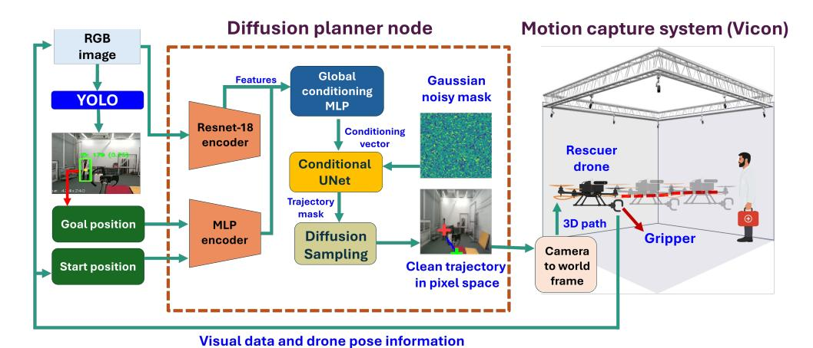
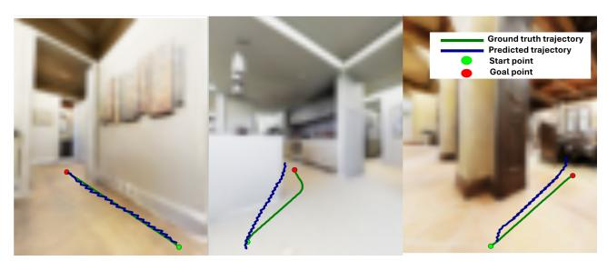
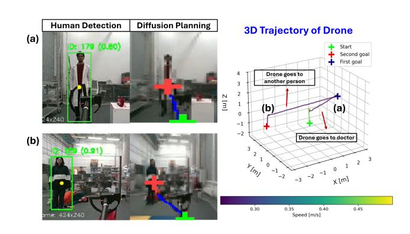
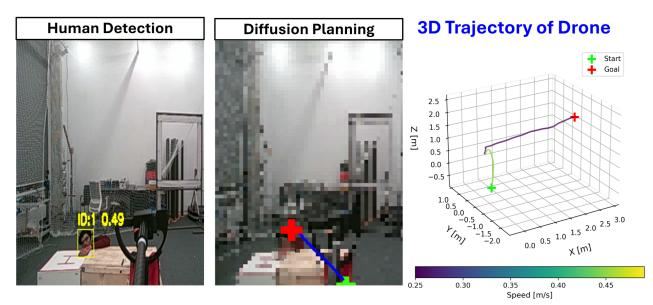

# HumanDiffusion: A Vision-Based Diffusion Trajectory Planner with Human-Conditioned Goals for Search and Rescue UAV

Faryal Batool Skolkovo Institute of Science and Technology Moscow, Russia Faryal.Batool@skoltech.ru

Roohan Ahmed Khan∗ Skolkovo Institute of Science and Technology Moscow, Russia ra.khan@skoltech.ru

Iana Zhura∗ Skolkovo Institute of Science and Technology Moscow, Russia iana.zhura@skoltech.ru

Ivan Valuev Skolkovo Institute of Science and Technology Moscow, Russia ivan.valuev@skoltech.ru

Dzmitry Tsetserukou Skolkovo Institute of Science and Technology Moscow, Russia d.tsetserukou@skoltech.ru

Valerii Serpiva∗ Skolkovo Institute of Science and Technology Moscow, Russia valerii.serpiva@skoltech.ru

Issatay Tokmurziyev Skolkovo Institute of Science and Technology Moscow, Russia Issatay.Tokmurziyev@skoltech.ru

Figure 1: HumanDiffusion architecture. YOLO provides human-based goal points, then the image and start–goal information are encoded and fused to condition a UNet-based diffusion model. The model generates a clean pixel-space trajectory, which is converted to a 3D world-frame path for execution by the rescuer drone with a gripper.

# Abstract

Reliable human–robot collaboration in emergency scenarios requires autonomous systems that can detect humans, infer navigation goals, and operate safely in dynamic environments. This paper presents HumanDiffusion, a lightweight image-conditioned diffusion planner that generates human-aware navigation trajectories directly from RGB imagery. The system combines YOLO-11–based human detection with diffusion-driven trajectory generation, enabling a quadrotor to approach a target person and deliver medical

∗Equal contribution.

assistance without relying on prior maps or computationally intensive planning pipelines. Trajectories are predicted in pixel space, ensuring smooth motion and a consistent safety margin around humans. We evaluate HumanDiffusion in simulation and real-world indoor mock-disaster scenarios. On a 300-sample test set, the model achieves a mean squared error of 0.02 in pixel-space trajectory reconstruction. Real-world experiments demonstrate an overall mission success rate of 80% across accident-response and searchand-locate tasks with partial occlusions. These results indicate that human-conditioned diffusion planning offers a practical and robust solution for human-aware UAV navigation in time-critical assistance settings.

## CCS Concepts

- Human-centered computing → Human robot interaction;
- Computing methodologies → Robotic planning; Neural networks; Computer vision.

## Keywords

human-robot interaction, diffusion models, image-conditioned navigation, human-guided goal generation, search and rescue

# 1 Introduction

Search and rescue (SAR) missions often operate under severe time constraints and limited situational awareness, where the locations of victims or medical personnel are unknown. Unmanned aerial vehicles (UAVs) are well suited to such settings due to their ability to access confined or hazardous environments and provide rapid assistance [\[10\]](#page-4-0). While modern SAR systems commonly integrate vision-based human detection [\[7,](#page-4-1) [25\]](#page-4-2) with autonomous navigation, most rely on predefined goals, explicit maps, or planning frameworks with significant computational overhead such as A\*, RRT\*, or Model Predictive Control (MPC) [\[11,](#page-4-3) [18\]](#page-4-4). These assumptions limit applicability in dynamic or partially observable environments where human locations must be inferred online. We propose a lightweight human-conditioned diffusion planner that generates global trajectories directly from RGB images, leveraging YOLO-based human detector. The center of the detected human bounding box is treated as an implicit goal, eliminating the need for maps and waypoints in goal inference. Although designed for real-world SAR, we evaluate the system in controlled indoor environments as a proofof-concept, focusing on medical handover tasks such as retrieving supplies from one individual and delivering them to another.

Our results show that diffusion-based planners can work well as perception-driven global planners. This provides a basis for future work that combines local obstacle avoidance and supports scalable human–robot collaboration in emergency response. The main contributions of this paper are:

- End-to-end image-conditioned diffusion planning: We develop a lightweight diffusion model that generates global trajectories conditioned solely on RGB images and the inferred start–goal pair, enabling map-free navigation.
- Integrated proof-of-concept system: We implement a fully functional indoor UAV pipeline supporting person identification, human-based goal generation, and autonomous trajectory execution with a gripper for object handover.
- Sim-to-real deployment: We train a diffusion planner solely on simulated RGB data and A\*-generated trajectories and successfully deploy it in two real-world indoor assistance scenarios.

# 2 Related Works

This section reviews prior work in UAV-based SAR, human-centered navigation, classical and learning-based UAV planning, diffusionbased trajectory generation, and multimodal vision–language UAV systems.

# 2.1 Human-Centered UAV Navigation for Search and Rescue

Prior UAV-SAR research emphasizes robust human perception, with YOLO-based detectors widely adopted for detecting small, distant, or partially occluded humans [\[1,](#page-3-0) [5,](#page-3-1) [20\]](#page-4-5). Surveys further highlight human detection as a core capability for aerial SAR platforms [\[19,](#page-4-6) [28\]](#page-4-7). Several works combine detection with filtering-based tracking to enable UAV-based human following [\[3,](#page-3-2) [8\]](#page-4-8). However, these approaches assume persistent visual contact and focus on local interaction, without connecting human perception to global navigation or planning. In contrast, our approach directly uses human detection to infer navigation goals and generate global trajectories.

# 2.2 UAV Navigation and Planning

Conventional UAV navigation pipelines rely on occupancy maps, classical planners such as A\* or RRT\*, and control strategies including MPC or learning-based controllers such as Reinforcement Learning for trajectory execution [\[2,](#page-3-3) [9,](#page-4-9) [13,](#page-4-10) [17,](#page-4-11) [18,](#page-4-4) [31,](#page-4-12) [32\]](#page-4-13). While effective in structured environments, these approaches typically depend on explicit maps, predefined waypoints, or accurate state estimation, which limits their applicability in scenarios where only onboard vision is available and navigation goals must be inferred online from perception.

# 2.3 Diffusion Models for Trajectory Planning

Diffusion models have recently gained significant attention for motion planning and trajectory synthesis. Vision-based diffusion planners such as NoMaD [\[23\]](#page-4-14) and DiPPeR [\[16\]](#page-4-15) generate navigation trajectories conditioned on RGB observations, cost fields, or object-level goals, demonstrating strong generalization in unknown and cluttered environments compared to classical planners. Recent surveys further highlight the rapid adoption of diffusion models for robotic motion generation and decision-making [\[24,](#page-4-16) [26,](#page-4-17) [33\]](#page-4-18).

## 2.4 Vision–Language Models for UAV Reasoning

Recent work integrates vision–language models (VLMs) with UAVs to enable semantic reasoning and high-level mission understanding. UAV-VLRR combines VLM-based scene interpretation with NMPC for SAR tasks [\[27\]](#page-4-19), while FlightGPT and UAV-VLA explores language-guided UAV navigation [\[4,](#page-3-4) [22\]](#page-4-20). Other studies investigate VLM-guided object detection and navigation [\[6,](#page-4-21) [14,](#page-4-22) [29\]](#page-4-23). Despite their strong reasoning capabilities, these systems do not couple human-aware perception with generative trajectory planning or automatic goal inference. Overall, prior methods either detect humans without planning, perform local following, rely on predefined goals, or employ diffusion planners without human-conditioned goal inference. Our work bridges this gap by unifying human detection with diffusion-based trajectory generation, enabling end-to-end, map-free global planning for search and rescue, driven directly by detected humans.

## 3 System Architecture

The HumanDiffusion framework as shown in Figure [1](#page-0-0) consists of two core modules: (i) a YOLO-based perception system that detects humans and outputs a dynamic goal point, and (ii) a diffusion-based trajectory generator that predicts a path in pixel space conditioned on the RGB image, start and inferred goal location.

#### 3.1 Perception and Human Goal Inference

The YOLO-11 detector identifies humans from incoming RGB frames, and the center of the selected bounding box is used as the navigation goal. This goal updates continuously, allowing the UAV to track a moving human, while the start point is obtained from onboard localization and provided to the diffusion model as an additional conditioning signal.

#### 3.2 Diffusion-Based Trajectory Generator

The trajectory generator is based on a conditional UNet-based diffusion model inspired by [15]. The model predicts a pixel-space trajectory mask by iteratively denoising a noisy sample. The input is a three-channel mask  $x_0 \in \mathbb{R}^{B \times 3 \times H \times W}$ , where B is batch size, H and W are spatial dimensions, and the channels represent the start point, goal point, and trajectory mask.

Forward Diffusion Process. Noise is gradually added to the clean mask using a squared-cosine schedule:

$$x_t = \sqrt{\overline{\alpha}_t} x_0 + \sqrt{1 - \overline{\alpha}_t} \epsilon,$$

where  $x_t$  is the noisy sample at timestep t,  $\overline{\alpha}_t = \prod_{s=1}^t \alpha_s$  is the cumulative noise factor,  $\alpha_t = 1 - \beta_t$  with  $\beta_t$  the noise variance, and  $\epsilon \sim \mathcal{N}(0, I)$  is the Gaussian noise.

Reverse Denoising Process. During denoising, the conditional UNet predicts the clean mask  $\hat{x}_0$ , which is used in the Denoising Diffusion Probabilistic Model (DDPM) posterior:

$$x_{t-1} = \mu_t(x_t, \hat{x}_0) + \sigma_t z, \quad z \sim \mathcal{N}(0, I),$$

where  $\mu_t$  and  $\sigma_t$  are the posterior mean and standard deviation and and  $z \sim \mathcal{N}(0, I)$  is the Gaussian noise. This process is repeated from t = T to t = 0 while the start and goal channels are inpainted to ensure that the generated trajectory remains aligned with the specified boundary conditions.

*Training Objective.* The model is trained to reconstruct the trajectory mask and enforce accurate endpoints. The total loss is:

$$\mathcal{L} = \lambda_{\text{path}} L_{\text{path}} + \lambda_{\text{endpoint}} L_{\text{endpoint}},$$

where  $\lambda_{path}$  and  $\lambda_{endpoint}$  are the weights for trajectory reconstruction and endpoint accuracy respectively.

The trajectory reconstruction loss is:

$$L_{\text{path}} = w_t \frac{1}{N} \sum_{B,H,W} \left( T_{B,H,W}^{\text{pred}} - T_{B,H,W}^{\text{gt}} \right)^2,$$

where  $T^{\text{pred}}$  and  $T^{\text{gt}}$  are the predicted and ground-truth masks, respectively,  $w_t$  is the trajectory-channel weight, and and  $N = B \times H \times W$  is the total number of pixels across the batch. The endpoint loss is:

$$\begin{split} L_{\text{endpoint}} &= \frac{1}{2} \begin{bmatrix} w_s \frac{1}{N} \sum_{B,H,W} \left( S_{B,H,W}^{\text{pred}} - S_{B,H,W}^{\text{gt}} \right)^2 \\ &+ w_g \frac{1}{N} \sum_{B,H,W} \left( G_{B,H,W}^{\text{pred}} - G_{B,H,W}^{\text{gt}} \right)^2 \end{bmatrix}. \end{split}$$

where  $S^{\text{pred}}$ ,  $G^{\text{pred}}$  and  $S^{\text{gt}}$ ,  $G^{\text{gt}}$  denote predicted and ground-truth start and goal masks, respectively, with channel weights  $w_s$  and  $w_g$ . The factor  $\frac{1}{2}$  normalizes their combined contribution. The path loss ensures global geometric fidelity of the predicted trajectory, whereas the endpoint loss enforces accurate boundary conditions.

#### 3.3 Training Pipeline and Dataset Generation

We generate 9,800 ground-truth trajectories using the A\* planner on simulated environments from [12]. Among these, 8,000 samples are used for training, 1,500 for evaluation during training without doing any backpropagation, and 300 for testing. The dataset spans multiple indoor scenarios and start–goal pairs to promote generalization. Across multiple configurations, training with 100 diffusion steps and 30 epochs yielded the best performance.

## 4 Experimental Evaluation

The proposed HumanDiffusion pipeline was evaluated in real-world trials using a custom-built quadrotor equipped with an Intel RealSense D455 depth camera and an Intel NUC for onboard computation. The YOLO-11 detector identifed humans and generated dynamically updated goal points, while the diffusion-based planner produced pixel-space trajectories at rate of 0.2–0.3 s per frame. Both models ran off-board on a remote server and communicated with the onboard NUC via ROS. A custom gripper was attached for payload handling. The diffusion model outputs 2D trajectories in image pixel space, which are projected into 3D waypoints using depth measurements and calibrated camera intrinsics. No explicit obstacle map is constructed; instead, the planner operates vision-driven, mapless navigation framework.

#### 4.1 Results and Failure Analysis

The system was evaluated on a simulated test dataset and two real-world human-assistance scenarios: (1) Accident Response and (2) Search-and-Locate in Occluded Environments. Each scenario was executed 10 times, resulting in an overall success rate of 80%. Failures were categorized as follows: (i) Perception loss (2 trials), caused by camera limitations or severe human occlusion; (ii) Controller tracking errors (1 trial), due to transient state-estimation drift; and (iii) Communication dropouts (1 trial), which delayed trajectory updates.

All experiments were conducted in accordance with laboratory safety and ethical guidelines. The UAV was equipped with propeller guards, operated at a low flight speed of 0.3 m/s, and maintained a fixed stopping distance of 1 m from participants. No physical contact occurred during the trials. All three participants provided informed consent prior to experimentation.

#### 4.2 Evaluation on Test Dataset

The model was first evaluated on a test dataset comprising of 300 simulated images with corresponding ground-truth trajectories. Performance was measured using the mean squared error (MSE) between predicted and ground-truth trajectory masks in pixel space. The evaluation yielded an MSE of **0.02**, indicating close agreement between predicted and reference trajectories. Representative qualitative results are shown in Figure 2. Minor zigzag artifacts appear in

Figure 2: Comparison between diffusion predicted and annotated ground truth trajectories.

the predicted trajectories due to the original annotations being generated at a resolution of 512 × 512 and subsequently downsampled to 64 × 64 for training.

# 4.3 Evaluation on Real Indoor Scenarios

4.3.1 Scenario 1: Accident Response. In this scenario, the UAV is provided only with approximate locations of the hospital and accident site. Upon arriving at the hospital, the drone detects a doctor using YOLO-11, extracts the bounding-box center as the navigation goal, and approaches while respecting the safety margin. After receiving a medical kit, the UAV autonomously navigates to the accident site, identifies an injured person, and completes the handover. Across 10 trials, the system successfully completed 9 full delivery cycles. Figure [3](#page-3-6) illustrates a representative trajectory, including human detection and safe-distance stopping behavior.

4.3.2 Scenario 2: Search-and-Locate in Occluded Environments. This scenario evaluated the system's ability to track a partially occluded human concealed behind obstacles such as small hills or vegetation. When the human temporarily left the camera's field of view, the UAV continued navigation toward the last known goal position. Once visibility was restored, the goal was updated and the UAV completed delivery of water or medical supplies.

The system succeeded in 7 out of 10 trials. Figure [4](#page-3-7) shows an example of successful target reacquisition following temporary occlusion. Overall, HumanDiffusion achieved an 80% success rate in real-world trials. Performance in Scenario 2 was slightly lower due to communication delays and limited arena size, where the UAV occasionally detected the human only after reaching the operational boundary, leaving insufficient space for redirection under the enforced 1 m stopping margin. Despite these constraints, the results demonstrate that HumanDiffusion enables reliable, safe, and human-aware assistance through diffusion-based trajectory planning combined with real-time human detection.

# 5 Conclusion and Future Work

This work introduced HumanDiffusion, a vision based, diffusion driven trajectory generation framework for human assistance with autonomous aerial robots. By combining YOLO-11 based human detection with a conditional diffusion model, the system produces smooth, safe, and goal consistent trajectories directly in pixel space. Real-world evaluations showed reliable performance across accident response and search-and-locate scenarios, achieving an overall success rate of 80%. These results indicate that diffusion based planning is a robust alternative to classical navigation methods in

Figure 3: Human detection results for Scenario 1 with the corresponding diffusion-planned trajectories and the executed 3D flight path showing start position and goal updates.

Figure 4: Human detection results for Scenario 2 with the corresponding diffusion-planned trajectories and the executed 3D flight path showing start position and goal updates.

dynamic human–robot interaction settings. Future work will extend HumanDiffusion with gesture guided human selection, multi human handling with prioritization and target switching as in [\[21,](#page-4-26) [30\]](#page-4-27), and improved collision awareness in dynamic environments. These directions move the system toward fully autonomous, context aware aerial assistance suitable for real-world deployment.

## Acknowledgment

Research reported in this publication was financially supported by the RSF–DST grant No. 24-41-02039.

# References

- [1] Yawar Abbas, Naif Al Mudawi, Bayan Alabdullah, Touseef Sadiq, Asaad Algarni, Hameedur Rahman, and Ahmad Jalal. 2024. Unmanned aerial vehicles for human detection and recognition using neural-network model. Frontiers in Neurorobotics 18 (Dec. 04, 2024).
- [2] Demetros Aschu, Robinroy Peter, Sausar Karaf, Aleksey Fedoseev, and Dzmitry Tsetserukou. 2024. MARLander: A Local Path Planning for Drone Swarms using Multiagent Deep Reinforcement Learning. In Proc. IEEE Int. Conf. on Systems, Man, and Cybernetics (SMC). 2943–2948.
- [3] Ahmad A. Bany Abdelnabi and Ghaith Rabadi. 2024. Human Detection From Unmanned Aerial Vehicles' Images for Search and Rescue Missions: A State-ofthe-Art Review. IEEE Access 12 (Oct 14, 2024), 152009–152035.
- [4] Hengxing Cai, Jinhan Dong, Jingjun Tan, Jingcheng Deng, Sihang Li, Zhifeng Gao, Haidong Wang, Zicheng Su, Agachai Sumalee, and Renxin Zhong. 2025. FlightGPT: Towards Generalizable and Interpretable UAV Vision-and-Language Navigation with Vision-Language Models. arxiv:2505.12835.
- [5] Francesco Ciccone and Alessandro Ceruti. 2025. Real-Time Search and Rescue with Drones: A Deep Learning Approach for Small-Object Detection Based on YOLO. Drones 9, 8 (July 22, 2025).

- [6] Nicoleta Cristina Gaitan, Bianca Ioana Batinas, and Calin Ursu. 2025. AI-Enhanced Rescue Drone with Multi-Modal Vision and Cognitive Agentic Architecture. AI 6, 10 (Oct. 16, 2025).
- [7] Alessandro Giusti, Jérôme Guzzi, Dan C. Cireşan, Fang-Lin He, Juan P. Rodríguez, Flavio Fontana, Matthias Faessler, Christian Forster, Jürgen Schmidhuber, Gianni Di Caro, Davide Scaramuzza, and Luca M. Gambardella. 2016. A Machine Learning Approach to Visual Perception of Forest Trails for Mobile Robots. IEEE Robotics and Automation Letters 1, 2 (Dec. 17, 2016), 661–667.
- [8] Juan Gómez, Olivier Aycard, and Junaid Baber. 2023. Efficient Detection and Tracking of Human Using 3D LiDAR Sensor. Sensors 23, 10 (May 12, 2023).
- [9] Roohan Ahmed Khan, Valerii Serpiva, Demetros Aschalew, Aleksey Fedoseev, and Dzmitry Tsetserukou. 2025. AgilePilot: DRL-Based Drone Agent for Real-Time Motion Planning in Dynamic Environments by Leveraging Object Detection. In Proc. IEEE Int. Conf. on Unmanned Aircraft Systems (ICUAS). 185–192.
- [10] Mohammadjavad Khosravi, Rushiv Arora, Saeede Enayati, and Hossein Pishro-Nik. 2025. A Search and Detection Autonomous Drone System: From Design to Implementation. IEEE Transactions on Automation Science and Engineering 22 (May 08-10, 2025), 3485–3501.
- [11] Johannes Köhler, Daniel Zhang, Raffaele Soloperto, Andrea Carron, and Melanie Zeilinger. 2025. An MPC framework for efficient navigation of mobile robots in cluttered environments. arxiv:2509.15917.
- [12] Kenny LHW. 2024. VLN-Go2-Matterport Dataset. [https://huggingface.co/](https://huggingface.co/datasets/Kennylhw/VLN-Go2-Matterport) [datasets/Kennylhw/VLN-Go2-Matterport.](https://huggingface.co/datasets/Kennylhw/VLN-Go2-Matterport) Accessed: 2025-02-08.
- [13] Jian Li, Changyi Liao, Weijian Zhang, Haitao Fu, and Shengliang Fu. 2022. UAV Path Planning Model Based on R5DOS Model Improved A-Star Algorithm. Applied Sciences 12, 22 (Nov. 08, 2022).
- [14] Ye Li, Li Yang, Meifang Yang, Fei Yan, Tonghua Liu, Chensi Guo, and Rufeng Chen. 2025. NavBLIP: a visual-language model for enhancing unmanned aerial vehicles navigation and object detection. Frontiers in Neurorobotics Volume 18 - 2024 (Jan. 24, 2025).
- [15] Jing Liang, Amirreza Payandeh, Daeun Song, Xuesu Xiao, and Dinesh Manocha. 2024. DTG : Diffusion-based Trajectory Generation for Mapless Global Navigation. In Proc. IEEE Int. Conf. on Intelligent Robots and Systems (IROS). 5340–5347.
- [16] Jianwei Liu, Maria Stamatopoulou, and Dimitrios Kanoulas. 2024. DiPPeR: Diffusion-based 2D Path Planner applied on Legged Robots. In 2024 IEEE International Conference on Robotics and Automation (ICRA). 9264–9270.
- [17] Wenlong Meng, Xuegang Zhang, Lvzhuoyu Zhou, Hangyu Guo, and Xin Hu. 2025. Advances in UAV Path Planning: A Comprehensive Review of Methods, Challenges, and Future Directions. Drones 9, 5 (May 16, 2025).
- [18] Stefano Primatesta, Alessandro Pagliano, Giorgio Guglieri, and Alessandro Rizzo. 2021. Model Predictive Sample-based Motion Planning for Unmanned Aircraft Systems. In Proc. IEEE Int. Conf. on Unmanned Aircraft Systems (ICUAS). 111–119.
- [19] Carlos Osorio Quero and Jose Martinez-Carranza. 2025. Unmanned aerial systems in search and rescue: A global perspective on current challenges and future applications. International Journal of Disaster Risk Reduction 118 (Feb. 6, 2025), 105199.
- [20] Oscar Ramírez-Ayala, Iván González-Hernández, Sergio Salazar, Jonathan Flores, and Rogelio Lozano. 2023. Real-Time Person Detection in Wooded Areas Using Thermal Images from an Aerial Perspective. Sensors 23, 22 (Nov. 16, 2023).
- [21] Federico Rollo, Andrea Zunino, Gennaro Raiola, Fabio Amadio, Arash Ajoudani, and Nikolaos Tsagarakis. 2023. FollowMe: a Robust Person Following Framework Based on Visual Re-Identification and Gestures. In Proc. IEEE Int. Conf. on Advanced Robotics and Its Social Impacts (ARSO). 84–89.
- [22] Oleg Sautenkov, Yasheerah Yaqoot, Artem Lykov, Muhammad Ahsan Mustafa, Grik Tadevosyan, Aibek Akhmetkazy, Miguel Altamirano Cabrera, Mikhail Martynov, Sausar Karaf, and Dzmitry Tsetserukou. 2025. UAV-VLA: Vision-Language-Action System for Large Scale Aerial Mission Generation. In ACM/IEEE Int. Conf. on Human-Robot Interaction (HRI). 1588–1592.
- [23] Ajay Sridhar, Dhruv Shah, Catherine Glossop, and Sergey Levine. 2024. NoMaD: Goal Masked Diffusion Policies for Navigation and Exploration. In Proc. IEEE Int. Conf. Conference on Robotics and Automation (ICRA). 63–70.
- [24] Toshihide Ubukata, Jialong Li, and Kenji Tei. 2024. Diffusion Model for Planning: A Systematic Literature Review. arxiv:2408.10266.
- [25] Pavan Kumar V, G. Likhith Reddy, H. Mahadev, V. Harish Kumar, and K. Krishna Prasad. 2025. Real-Time Detection of Unmanned Aerial Vehicles Using YOLOv8. In Proc. IEEE Int. Conf. on Inventive Research in Computing Applications (ICIRCA). 216–223.
- [26] Rosa Wolf, Yitian Shi, Sheng Liu, and Rania Rayyes. 2025. Diffusion models for robotic manipulation: a survey. Frontiers in Robotics and AI 12 (Sept. 09, 2025).
- [27] Yasheerah Yaqoot, Muhammad Ahsan Mustafa, Oleg Sautenkov, Artem Lykov, Valerii Serpiva, and Dzmitry Tsetserukou. 2025. UAV-VLRR: Vision-Language Informed NMPC for Rapid Response in UAV Search and Rescue. In IEEE Intelligent Vehicles Symposium (IV). 1195–1200.
- [28] Xiangqing Zhang, Yan Feng, Nan Wang, Guohua Lu, and Shaohui Mei. 2025. Aerial Person Detection for Search and Rescue: Survey and Benchmarks. Journal of Remote Sensing 5 (March 25, 2025), 0474.

- [29] Yuhang Zhang, Haosheng Yu, Jiaping Xiao, and Mir Feroskhan. 2025. Grounded Vision-Language Navigation for UAVs with Open-Vocabulary Goal Understanding. arxiv:2506.10756.
- [30] Kaiyang Zhou, Yongxin Yang, Andrea Cavallaro, and Tao Xiang. 2019. Omni-Scale Feature Learning for Person Re-Identification. In Proc. IEEE Int. Conf. on Computer Vision (ICCV). 3701–3711.
- [31] Qiang Zhou and Guangcai Liu. 2022. UAV Path Planning Based on the Combination of A-star Algorithm and RRT-star Algorithm. In Proc. IEEE Int. Conf. on Unmanned Systems (ICUS). 146–151.
- [32] Xin Zhou, Zhepei Wang, Hongkai Ye, Chao Xu, and Fei Gao. 2021. EGO-Planner: An ESDF-Free Gradient-Based Local Planner for Quadrotors. IEEE Robotics and Automation Letters 6, 2 (Dec. 28 2021), 478–485.
- [33] Iana Zhura, Sausar Karaf, Faryal Batool, Nipun Dhananjaya Weerakkodi Mudalige, Valerii Serpiva, Ali Alridha Abdulkarim, Aleksey Fedoseev, Didar Seyidov, Hajira Amjad, and Dzmitry Tsetserukou. 2025. SwarmDiffusion: End-To-End Traversability-Guided Diffusion for Embodiment-Agnostic Navigation of Heterogeneous Robots. arxiv:2512.02851.